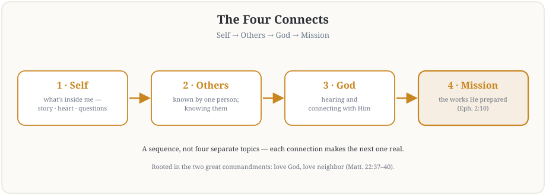

**FELLOWSHIP OF THE HEART**

*for Teens and Their Parents*

Getting Started series

**The Four Connects**

*A Fifteen-Week Journey into the Heart of God*

**FORMATION COMPANION HANDBOOK**

Pilot edition — Covenant Christian Academy of Warrenton

*Based on the Intentional Journey of the Heart (IJH), Volumes 1–6*

*John G. Tittle • Curriculum draft v2, May 2026*

# A Letter to the Companion

If you have this handbook in your hand, it is because someone trusted you with something delicate.

What follows is a fifteen-week club for teenagers, ages roughly twelve through eighteen, and at least one of their parents. The club is built on the spine of the four Connects — Connecting with Self, with Others, with God, and with Mission — which I have spent over twenty years exploring in the Intentional Journey of the Heart project. The full project is documented in six volumes of academic and kitchen-table writing. None of that matters very much for what you are about to do. What matters is that for ninety minutes a week, fifteen weeks in a row, you are going to invite some of God’s youngest disciples — and the parents who love them — to begin a journey of the heart that, if the Lord wills, will not stop when these fifteen weeks are over.

I want to say a few things before you turn the page.

### This is not a youth group lock-in

There will be teaching, there will be scripture, there will be laughter and snacks and probably some awkwardness. There will also be moments — and I mean this — when the Holy Spirit will show up in a fourteen-year-old’s interior life in a way that will surprise everyone in the room. Your job is to be ready for those moments. Not to make them happen. To be ready when they do.

The container conditions described in Section 5 are how you get ready. Read them, internalize them, practice them with your Co-Companion before Week 1. The container is not a ritual. It is the prepared space inside which the Spirit characteristically works.

### The parents are participants, not chaperones

This is the design choice I am most worried you will get wrong, so let me say it directly. A parent who sits in the back drinking coffee while their kid does the work has not understood the assignment. The whole point is that the parent is on their own journey, beside their teen, doing real work too. If you let the parents off the hook, the teens will feel it, and the work will not go where it could.

That said: parents do not do their work in front of their own kid, and kids do not do their work in front of their own parent. Section 5 has the parallel-circle design and the rules for when we split and when we come back together. Follow it.

### You will not be the agent of transformation

If the Spirit moves a teen during the Garden of Your Heart exercise, it will not be because of how you ran it. It will be because the Spirit chose to move. Your job is to create the conditions — safety, presence, clarity, intentionality — and then to get out of the way. Most Companion failures I have seen come from Companions who tried to make something happen instead of preparing the ground for the Spirit to do what only the Spirit can do.

### Be on the journey yourself

You cannot lead someone where you have not been. If you have not done your own work on the four Connects, do not lead this club until you have. The handbook includes a Companion preparation rhythm for the eight weeks before Week 1 — work it. The teens will read your interior life faster than they read any of the handouts.

That is enough preface. Read the handbook. Pray over it. Find a Co-Companion. And then begin.

*Blessings on the journey,*

*John*

*Granddaddy, and one of the writers of this work*

# Section 1 — The Series at a Glance

## Title and theme

**Title:** The Four Connects — A Fifteen-Week Journey into the Heart of God

**One-sentence aim:** By the end of the series, every teen and every parent in the room will know — from the inside, not from a handout — what it feels like to begin connecting honestly with themselves, with one another, with God, and with the work He has prepared for them.

## The big idea

The Four Connects are not four topics on a syllabus. They are a sequence with directional dependencies that matter (IJH Volume 2, Fifth Exploration). You cannot connect with Others until you have begun to know yourself. You cannot connect with God in a way that goes beyond performance until you are honest with yourself and have at least one person who knows your interior life. And you cannot find and live the mission God prepared for you until the first three connections are real. The Getting Started series walks the cohort through that sequence on purpose, and at the end, hands them the rhythms they need to keep walking.

*The four Connects as one sequence, rooted in the two great commandments.*

*“And he said to him, 'You shall love the Lord your God with all your heart and with all your soul and with all your mind. This is the great and first commandment. And a second is like it: You shall love your neighbor as yourself.'”*

— Matthew 22:37–39 (ESV)

These two commandments are the source of the four Connects. Loving God with all the heart, soul, and mind requires honest knowledge of that heart, soul, and mind (Self). Loving neighbor as self requires being known and knowing (Others). Both rest on connection with God Himself, and both bear fruit in the works God has prepared for us to walk into (Mission).

## Series outcomes

By the end of the fifteen-week Getting Started series, we expect the following outcomes — recognizing that the Holy Spirit is the agent of all real movement, and that some teens and parents will move further than others.

### For every participant

- Has experienced — not just learned about — what genuine community feels like, and can articulate the difference between Christian socializing and Christian formation.
- Has told their story (or a piece of it) in front of a small circle and has been heard, blessed, and reflected back.
- Has practiced at least three core hearing exercises and can name which one most reliably opens their heart to scripture.
- Owns a Personal Heart Journal with twelve to fifteen weeks of entries, and a single-page Daily / Weekly / Monthly Rhythm Card they have actually used.
- Knows what the next step looks like — the Going Deeper series — and has either committed or made a clear decision.

### Affective Taxonomy goals by cohort

Drawing on the five-stage taxonomy in Vol 2 Exp 7 (Receiving → Responding → Valuing → Organization → Characterization), we are not trying to push every participant to Level 3 in fifteen weeks. The honest target is to get the cohort to the threshold of the Level 2-to-Level 3 transition, where intrinsic motivation begins to take over from external structure. Specifically:

**Junior cohort (12–14):** Move from Level 1 (Receiving — willing to attend) to a stable Level 2 (Responding — actively engaging when prompted, completing between-session practices, contributing in shared circles).

**Senior cohort (15–18):** Move from Level 2 (Responding) toward the threshold of Level 3 (Valuing — intrinsic motivation begins to appear in private practice between sessions).

**Parents:** Wherever they begin (and there will be a wide range), move at least one full level. For parents already at Level 3, surface the specific Connect that is weakest and let the series be the unblocking.

The goal at every cohort is *integrated* attainment of the target level, not just touching it — a participant who reaches Level 2 (Responding) with genuine Level 1 Receiving still alive is sturdier than one who has skipped past Level 1's openness in order to perform Level 2's engagement. (The integration framing is developed pastorally in V2.Exp7 and operationalized for the testing protocol in IJH Vol 4 §2; it applies here as the realistic shape of what "stable at Level 2" means.)

**How to hold these levels.** These cohort targets are a *Companion's* diagnostic lens for shaping the cohort's care — not a destination a participant must reach, a scorecard, or a measure of anyone's standing with God. A participant's standing in Christ is complete by grace, the same at every stage (1 Cor. 4:7); the one who seems "stuck" at Receiving may be exactly where grace is doing its deepest work, and a dry season is not a lower level. We never rank a person's worth, or their belovedness, by a taxonomy stage. And a participant's stage is **never disclosed to the participant or their parent** — growth is always spoken in the language of story and specific moments, not levels.

## Session map

The full fifteen-session map — one map for the whole series, with the Companion-in-Formation second-runnings built in (see Section 11 for the teen-leadership track this map carries). Detailed lesson plans live in a separate document; this is the architectural view.

| **Wk** | **Title** | **Connect** | **Anchor scripture** | **Key practice** | **Who leads** |
| --- | --- | --- | --- | --- | --- |
| 1 | Welcome to the Journey | All four (intro) | John 10:10b | Container intro; Why are we here | Adult models; seniors watch the container for the first time |
| 2 | The Soil of Your Heart | Self | Mark 4:1–20 | Heart Soil diagnostic, age-adapted | Adult leads; teen assists (setup, scripture reading) |
| 3 | Telling Your Story I | Self | Psalm 139:23–24 | Story — first batch tells; adult models listening + blessing | Adult-led; the seniors tell their own story here — they receive before they lead |
| 4 | Telling Your Story II | Self | Psalm 139:23–24 | Story — rest of the group tells (second running) | Teen-led: container + story facilitation + blessing round; adult holds any heavy disclosure |
| 5 | Knowing and Being Known | Others | Eccl. 4:9–12 | Container conditions experienced fully | Teen leads container open/close; center co-led (adult in room) |
| 6 | Safe and Brave Together | Others | James 5:16 | Confession-and-restoration practice | Adult-held center; teen may lead the container scaffolding only |
| 7 | Hearing God in Scripture — PROAPT I | God | Romans 10:17 | PROAPT, simplified six-step — first walk-through, taught | Adult-led; the seniors receive the practice |
| 8 | Hearing God — PROAPT II | God | Romans 10:17 | PROAPT — second running, in pairs | Teen-led: the full PROAPT walk-through — the cleanest teen-led block |
| 9 | The Garden of Your Heart I | God | John 15:1–11 | Garden — framing + first guided run | Adult-led; the seniors receive |
| 10 | The Garden of Your Heart II | God | John 15:1–11 | Garden — second guided run | Teen leads the guided walk-through; adult holds the debrief and anything that surfaces |
| 11 | Any Doubts? Bringing the Real Question | God | Mark 9:24 | Any Doubts? practice, age-adapted | Adult-held center; teen may lead the container scaffolding only |
| 12 | What Was Prepared for You | Mission | Ephesians 2:10 | Gifts inventory; downhill mission | Teen co-leads; name leading-as-mission here |
| 13 | The Rhythm and the Dry Season | All four (sustaining) | Gal. 6:9; Ps. 42:1–5 | Rhythm Card installed; Signs Card + Path Home Card taught; mission work completes | Teen-led marquee — the fourth clean senior-led block |
| 14 | Sending and Blessing | All four (integration) | Numbers 6:24–26 | Family commissioning; Post-Series Survey; reflection circle | Adult-led; teens co-lead pieces |
| 15 | Commissioning the Companions | All four | The FC1 exit gate as a witnessed rite; commissioning; first Leader Lab of the serving cycle scheduled | The seniors lead; the cohort witnesses |

**A note on the sequence:** Weeks 2–4 establish Self before Weeks 5–6 ask anyone to connect with Others. Weeks 7–11 build God-connection on top of Self and Others. Week 12 (Mission) only works if the first three Connects have begun. Week 13 installs the long-walk rhythm before the sending, and Weeks 14–15 close the series in two movements — the whole cohort sent, then the Companions-in-Formation commissioned. Do not rearrange the weeks without a strong reason — the dependencies are part of the design. The second-running weeks (4, 8, 10) teach nothing new: they complete a practice the cohort has already begun, and they are the marquee slots a senior leads (Section 11).

## Series-to-claim mapping

For Companions who want to trace each session back to the IJH source. The claim IDs reference the Volume 6 claim registry.

| **Wk** | **IJH primary source** | **Claim(s) in play** |
| --- | --- | --- |
| 1 | Vol 2 Intro & Exploration 8 (Container) | V2.E8-S1 (Container conditions) |
| 2 | Vol 2 Exp 1 (Heart Soil) | V2.E1-D1 (Heart Soil diagnostic) |
| 3–4 | Vol 2 Exp 5 (Connecting with Self) & 7 (Footprints) | V2.E5-S1 (Four Connects sequence); V2.E7-O3 (Footprints) |
| 5 | Vol 2 Exp 5 (Connecting with Others) & 8 (Container) | V2.E5-S1; V2.E8-S1 |
| 6 | Vol 2 Exp 4 (Confession) & 9 (Community) | V2.E4-O1 (Confession law); V2.E9-S1 (Community amplification) |
| 7–8 | Vol 1 Exp 1 (Faith from hearing) & Vol 2 Exp 7 (PROAPT) | V1.E1-O1 (Word→Hearing→Faith); V2.E7-O4 (PROAPT) |
| 9–10 | Vol 2 Exp 7 (Garden of Your Heart) | V2.E7-O2 (Garden as encounter) |
| 11 | Vol 2 Exp 7 (Any Doubts?) | V2.E7-O1 (Any Doubts? as faith development) |
| 12 | Vol 2 Exp 5 (Connecting with Mission) | V2.E5-S2 (Uphill/downhill mission) |
| 13 | Vol 2 Exp 10 (Training Plan); the Signs Card's IJH grounding (desolation dynamics, Vol 2 Exp 7) | V2.E10-D1 (Sustainable training rhythm) |
| 14 | Integration; Vol 2 Exp 10 | V2.E10-D1 |
| 15 | Vol 5 The Formation Companion (FC1 level definition); Section 11 | V2.E8-S1 (container fluency as FC1's spine) |

# Section 2 — Audience and Cohort Design

## Who this is for

The Getting Started series is designed for teens and parents from Covenant Christian Academy of Warrenton and the broader CCA community. The expected mix:

- Teens, ages 12–18, attending with at least one parent (or grandparent or legal guardian acting in loco parentis).
- Most teens will already identify as Christian; some will not, and that is not a barrier to participation. The series invites without coercing.
- A wide range of formation maturity. Some teens will be at Affective Taxonomy Level 1 (showing up because Mom said). Some will already be at Level 3 (asking the questions on their own). Both belong.
- Parents at varying levels of formation themselves. We design for the parent who has never done this kind of interior work, and we leave room for the parent who has.

## Group size

| **Configuration** | **Recommended** | **Notes** |
| --- | --- | --- |
| Total participants (teens + parents) | 16–30 | Below 16, the parallel-circle work loses dynamism. Above 30, intimacy in the small circles is hard to sustain. |
| Teen-to-parent ratio | ~1:1 | Each teen brings at least one parent. Two parents per teen is welcome. |
| Junior cohort (12–14) | 4–8 teens | Combine with parents into circles of no more than 8. |
| Senior cohort (15–18) | 4–8 teens | Same. |
| Parent circle (when split) | 8–16 parents | If larger, split into two parent circles. |
| Total Companions required | 3–4 | See Section 3 for the team structure. |

## Junior and senior cohorts

A 12-year-old and an 18-year-old are not the same audience. The curriculum splits them for cohort-specific work and brings them together for shared content.

### Why split

Three reasons:

1. Developmental gap. Junior-cohort teens (12–14) are still consolidating self-awareness and abstract thinking. Senior-cohort teens (15–18) are wrestling with identity, agency, and life direction in ways that need different conversation partners.
2. Modeling and safety. A 12-year-old will not bring up real interior content with an 18-year-old in the same circle, and an 18-year-old will not be authentic in front of a 12-year-old. Splitting gives each cohort the cohort-mates they need.
3. Pacing. Some practices (longer story-telling, the Any Doubts? exercise, the deeper Garden of Your Heart) work at full depth for senior cohort and a lightened version for junior cohort. Same scripture, same Connect, different depth.

### When to split, when to merge

As a general rule:

- **Split for:** personal sharing, story-telling, experiential practices that involve disclosure, and any reflection on wounds or doubts.
- **Merge for:** teaching, scripture engagement, worship, blessings, the closing circle, and shared meals.

Each session’s lesson plan specifies the mode (split vs. merged) for each block. Do not improvise this on the fly.

## The parent dimension

The parent role in this series is the design choice with the highest leverage and the greatest risk.

### Parents as participants

The parent’s job is to do the work, alongside their teen but not at them. A parent who genuinely engages their own Connect-with-Self work — who tells their own story, names their own doubts, sits in their own Garden of Your Heart — will form their teen by example far more powerfully than any teaching ever will. A parent who comes as a chaperone, a fixer, or an audience member sends the opposite signal.

### Parents not in their teen’s circle

Three exceptions to the general rule that parents and teens do their work in separate circles:

1. In Week 1 (orientation) and Weeks 14–15 (commissioning), parents and teens are together intentionally.
2. Some between-session practices are designed for parent and teen to do together at home (the Family Conversation Cards, the joint Footprints exercise in Week 3 prep). Those are explicitly bridge moments.
3. If a teen specifically requests their parent’s presence for a difficult disclosure, that is the teen’s call. Companions support but do not arrange this.

### Single-parent and complex family situations

Many CCA families have configurations that do not fit a two-parent model. The handbook assumes “at least one parent or guardian.” If a teen would attend but no parent will, do not turn them away — instead, recruit a sponsoring adult from the CCA or church community to walk alongside them. The dyad matters more than the biology.

# Section 3 — Companion Profile and Team

## The Companion team

The Getting Started series cannot be run by one person. Plan for a team of three to four:

| **Role** | **Primary responsibility** | **Required posture** |
| --- | --- | --- |
| Lead Companion | Owns the arc of the series, runs main teaching blocks, makes real-time judgment calls. | Has done the IJH journey personally; experienced small-group Companion; pastoral or counseling background preferred. |
| Cohort Companion (Teen Circles) | Runs the teen-only circles when split; knows each teen by name; tracks individual growth. | Comfortable with adolescents; either youth-ministry trained or actively walking alongside teens; same gender as the larger teen cohort if cohort is single-gender, or paired with co-fac of other gender if mixed. |
| Cohort Companion (Parent Circle) | Runs the parent-only circle when split; gives parents permission to do their own work without managing their kid. | Adult-formation experience; can hold space for parents who are not used to being asked to do their own work. |
| Pastoral / Clinical Backup | On-call (not in the room) for crisis follow-up; consulted on disclosure protocols. | Licensed counselor or trained pastor familiar with adolescents; named in writing in advance. |

## Required competencies

Drawing on the Formation Companion framework in Volume 5 (developmental progression with capstone competency of real-time mode-switching among the four traditions: pastoral counseling, spiritual direction, inner healing, and discipleship/coaching — see the [Formation Companion](https://jgtittle-ministries.github.io/Intentional-Journey-of-the-Heart-dev/reader.html#docs%2Fvolume-5-references%2Fthe-formation-companion.md) chapter in IJH Volume 5 for the level definitions and level-to-role mapping), the Companion team should collectively cover the following competencies. Not every individual must hold all of them, but the team must.

### Foundational (every Companion)

1. Personal practice. The Companion is currently engaged in their own Daily / Weekly / Monthly rhythm — not as someone who once did this work, but as someone who is doing it now. The teens and parents will perceive this within the first session whether they can articulate it or not.
2. Container competence. Can establish and hold the four container conditions (Safe, Present, Clear, Intentional, see Section 5) under pressure, including when a participant is upset or when the room’s emotional temperature is climbing.
3. Scripture facility. Knows the anchor passages of the fifteen sessions well enough to teach without reading from notes for the bulk of the time, and can hold the room when an unanticipated question lands.
4. Pastoral discretion. Knows when to follow a thread and when to pull back, when to refer out, when to call a parent, when to involve school or pastoral leadership.

### Specialized (covered by at least one team member)

1. Adolescent development. Understands the developmental differences between a 12-year-old and an 18-year-old well enough to read the room and pace appropriately.
2. Mandatory reporting. Trained on Virginia state requirements [FOR LEGAL REVIEW: Virginia Code § 63.2-1509 designates teachers, administrators, and other school personnel as mandatory reporters of child abuse and neglect; CCA staff serving as Companions are mandatory reporters in their CCA-employee capacity. Volunteer Companions who are not CCA employees should be trained per CCA’s policy on volunteer mandatory-reporting expectations. The cohort’s confidentiality covenant explicitly excepts mandatory-reporting categories; this exception is named in every cohort’s Wk 1 framing and in the standing-pair covenant.] Confirm with CCA legal counsel before Wk 1: which Companions are statutory mandatory reporters; what the school’s internal reporting chain is for child-safety disclosures; and how the cohort space’s confidentiality covenant interacts with mandatory-reporting obligations for both CCA-employee Companions and volunteer Companions.
3. Crisis response. Has worked through the protocol in Section 6 with the pastoral / clinical backup person before Week 1, and knows what to do if a teen discloses suicidal ideation, abuse, or self-harm.
4. IJH framework fluency. Has read at minimum the Read Me First, Volume 2 (full), and the relevant Vol 1 explorations (1, 5, 6, 7), and can speak about the framework in their own words.

## Companion preparation rhythm

The eight weeks before Week 1, every Companion works the following rhythm. This is not optional. The handbook is structured so the Companion is one Connect ahead of the cohort at all times.

| **Wks before Wk 1** | **Personal work** | **Team work** |
| --- | --- | --- |
| Wk -8 to -7 | Read Vol 2 in full; complete personal Footprints exercise. | Team forms; commit to weekly meetings. |
| Wk -6 to -5 | Tell your own story (4-question version) to your Co-Companion; do the Heart Soil diagnostic on yourself. | Team Bible study together; do the container together; one team member tells their story each week. |
| Wk -4 to -3 | Run through Garden of Your Heart on yourself; identify your own current Mission question. | Recruitment and parent informed consent finalized; orientation session date set. |
| Wk -2 to -1 | PROAPT one passage daily; rehearse Week 1 lesson plan with Co-Companion. | Run a dress rehearsal of Week 1 with one or two trusted families; debrief; refine. |
| Wk 1 | Begin. | Begin. |

And for every cycle after the first: the long-arc hazard for a Companion is not burnout but quiet satisfaction — the drift that never misses a session. The [Keeping the Flame card](../shared/keeping-the-flame.md) is the team's standing defense (a personal self-check once a cycle, and the first Leader Lab of every serving cycle); it applies to the adult team exactly as much as to the FC1s.

One more thing about the team, worth saying before anyone asks: no one certifies a Formation Companion, and no one ever will from here. Standing comes from a named covering close enough to see the life — the Companion levels are safety floors the team assigns to itself honestly, not ranks anyone issues. [Companions and Coverings](../shared/companions-and-coverings.md) says what this work is and is not, how a body builds its own Companions, and how to receive one from outside.

# Section 4 — Theological and Institutional Posture

## Faithful to IJH

This series is the youth-and-parent on-ramp to the IJH journey. Every session draws from the Volumes, particularly Volume 2. We honor:

- The four foundational principles of IJH (laws of the Spirit exist; are knowable; are knowable in spirit, mind, and body; we can operate in them).
- The causal sequence of the four Connects (Self → Others → God → Mission, in that order, with directional dependencies).
- The Affective Taxonomy as the developmental backbone (Receiving → Responding → Valuing → Organization → Characterization).
- Scripture as the floor. Every session is anchored in a specific passage; the IJH framework is offered as one way of seeing what scripture is showing us, not as the source of authority.

## Respectful of CCA

Covenant Christian Academy is a classical Christian school in the Reformed-evangelical tradition. The Getting Started series is hosted in that environment and should be a good guest. We:

- Teach within a high view of scripture and historic Christian orthodoxy. The Apostles’ and Nicene Creeds are the doctrinal floor.
- Do not require participants to embrace the more speculative or experiential elements of IJH (Volume 1’s resonance laws, much of Volume 3) to engage well. Where IJH overlaps cleanly with mainstream evangelical formation — storytelling, scripture engagement, confession, community, prayer — we lean there.
- Introduce the experiential practices (Garden of Your Heart, Any Doubts?, the simplified hearing prayer in Week 8) gently and with explicit parent informed consent. These are invitations, not requirements.
- Defer to the school’s policies on disputed theological questions. Where IJH and the school’s tradition differ on, e.g., the contemporary operation of certain spiritual gifts, we present scripture and trusted Christian voices on multiple sides and let participants and their families discern.

## What we lean into

The Getting Started series leans hard into:

1. Scripture engagement that is personal, not just informational.
2. Honest self-knowledge, especially the Heart Soil diagnostic.
3. Confession and restoration in age-appropriate community.
4. Hearing God in scripture as a learnable skill (PROAPT, simplified).
5. The Ephesians 2:10 view of Mission — works prepared beforehand, walked into rather than engineered.
6. Parent-teen relationships as primary soil for formation.

## What we hold back

The Getting Started series intentionally does not include:

1. Deep wound work or false-self exploration in their adult IJH form. The Eldredge masculine-heart material is foundational in Volume 2 but is written for adult men. We adapt the universal scriptural ground (Ephesians 2:10, Psalm 139) and pull back from depth that does not belong at this age.
2. TPM-style cognitive blockage work in the room. If a teen surfaces a lie they are believing, we acknowledge, affirm, pray briefly, and follow up offline with parent and qualified care.
3. Anger-knot or grief-knot processing in the group. Same protocol as above.
4. Extended fasting, deliverance ministry, or similar high-intensity practices. (This means deliverance *ministry* — casting-out work — which is not for this setting. The believer’s ordinary watchfulness against the enemy’s lies, and the authority every Christian has in Christ, is a different thing and does belong in formation; we name the enemy plainly where Scripture does, without drama.)
5. Speculation about contested charismatic claims. We teach Romans 10:17 and the simple practice of hearing God in scripture; we do not litigate cessationism in either direction.

## A note on framing

If a teen, parent, or family asks why we hold certain things back, the honest answer is this: the IJH project includes content that has been tested in adult small groups for many years and is appropriate there. A youth-and-parent club is a different setting with different participants and different responsibilities. We are not hiding the deeper work — we are sequencing it. Some of it belongs in adult contexts. Some of it belongs in years to come for these teens, when their formation has matured. None of it belongs in a circle of mixed-age teenagers in week six of the series.

# Section 5 — The Container, Adapted for Teens and Parents

The container is the prepared interior space inside which any meaningful spiritual work can happen (Volume 2, Eighth Exploration). The four container conditions — Safe, Present, Clear, Intentional — are non-negotiable. What changes for this audience is the practical implementation, not the conditions themselves.

## The four conditions, re-stated for this audience

| **Condition** | **What it means here** | **How we build it** |
| --- | --- | --- |
| Safe | Nothing said in the circle leaves the circle, with the limits in Section 6. No judgment, no fixing, no interrupting. The teen knows they will not be made fun of. The parent knows they will not be embarrassed in front of their kid. | Confidentiality covenant signed at orientation; circle agreements re-stated each week; immediate, gentle correction by Companion if a participant breaks the agreement. |
| Present | Phones off. Side conversations off. Body and attention in the room with these specific people right now. | Phones in a box at the door (yes, including parents). Each session opens with a one-word check-in: how are you actually right now? |
| Clear | No unaddressed conflict between people in the room. No log in your own eye that you are pretending isn’t there. | Brief silent self-check at the open: is anything between me and someone else in the room? If yes, address it before or after the session, not during. |
| Intentional | Each participant has decided, before the session begins, that they are willing to do whatever the Spirit might invite them to do. | Spoken commitment at the open: 'I am here, I am paying attention, and I am willing to be moved.' |

## Opening container protocol

Every session opens with the same protocol. The repetition matters — it is part of how the container forms over the fifteen weeks. Read this script aloud or paraphrase from familiarity:

## Opening Container — Spoken Protocol (5 minutes)

**1. Welcome.** “Welcome back. We’re going to take five minutes to open the container. We do this every week because what happens here only happens when this is a real container, not just a meeting.”

**2. Phones in the box.** Allow 30 seconds. Yes, parents too.

**3. Stand in a circle (yes, standing).** Standing brings different energy than slouching on a couch. Hold for the next four steps.

**4. One-word check-in.** “One word for how you actually are right now — not how you usually are, not how you should be. Right now.” Each person, around the circle, says one word. No commentary. (‘Tired.’ ‘Anxious.’ ‘Excited.’ ‘Numb.’ ‘Grateful.’)

**5. Put out / bring in.** “Is there something you need to put down before we start so you can be present? Name it silently and let it go for the next ninety minutes. Now, what blessing or intention do you want to bring in?” Silent for 30 seconds.

**6. Spoken commitment.** Together: “I am here. I am paying attention. I am willing to be moved.”

**7. Opening prayer.** Brief, naming the Holy Spirit specifically. (“Holy Spirit, you are welcome here. Speak. We are listening.”)

**8. Sit.** Begin the session.

## Closing container protocol

How the meeting ends matters as much as how it begins (Volume 2, Tenth Exploration). The closing also runs five minutes, on a fixed protocol:

## Closing Container — Spoken Protocol (5 minutes)

**1. Stand again.** Same circle, same posture as the open.

**2. One-word landing.** “One word for what is happening in you right now as we close.” Around the circle. Compare to the opening word — the contrast is data.

**3. The one thing.** “What is one specific thing you are taking from tonight?” Each person, brief.

**4. The one practice.** “What will you actually practice between now and next week?” The session’s between-session practice is offered, and each person commits or modifies aloud.

**5. Blessings.** Anyone who has a specific blessing to speak over another person in the room — not a general prayer, but a specific witnessed blessing of what they saw the Father doing in that person tonight — does so. These should be short. They almost always land.

**6. Closing prayer and dismissal.** Brief. Name the Lord. Send them out.

## Parallel circles vs. shared circles

Each session’s lesson plan specifies which mode is used for which block. The general logic:

### Shared circle (everyone together)

- Opening container and closing container, every week, no exceptions.
- Teaching blocks. The teacher addresses the whole room.
- Scripture readings and shared worship.
- The Week 1 orientation and the Week 14–15 commissioning sessions, in their entirety.

### Parallel circles (split by cohort)

- Junior teens (12–14) with the teen Co-Companion.
- Senior teens (15–18) with the teen Co-Companion (or a separate Co-Companion if cohort is large).
- Parents with the parent Co-Companion.
- Use parallel circles for: personal sharing, story-telling, the experiential practices (Garden, Any Doubts?), confession-and-restoration work.

### Why parallel matters

If a teen has to share an honest doubt while their own parent is sitting two seats away, they will not share the actual doubt — they will share a version they think their parent can handle. Same for the parent. The parallel design protects both directions.

This is not a deception. The teens know their parents are doing parallel work. The parents know the teens are. What is held in confidence within each circle is held — with the explicit limits of Section 6 — and what the family wants to share with each other after, they can share at home.

## Adaptations for younger participants

For the junior cohort and any 12-year-old: the container is identical in structure but lighter in disclosure expectation. A 12-year-old’s honest “one-word check-in” might just be “good,” and that is fine. Do not pressure for depth. The container forms over weeks, not in week one. By week six, the same 12-year-old who said “good” in week one is often the one who surprises everyone with what surfaces.

# Section 6 — Safety, Confidentiality, and Crisis Protocols

## Read this section before Week 1. Walk through every protocol with the pastoral / clinical backup person and with CCA leadership. The protocols below are starting templates and must be reviewed by CCA’s legal and pastoral leadership and adapted to current Virginia law and CCA policy before use.

## Launch-blocking safety checklist — sign before Week 1

This one-page gate must be completed and **signed by the Lead Companion and the CCA head of school before Week 1**. The first list is *blocking* — the cohort does not begin until every item is true. The second is *maintenance* — verified at the start and re-checked annually. *(Scaffold: the bracketed items are operational facts for the team / CCA to supply.)*

**Must be true before Week 1 — blocking:**

- [ ] Pastoral / clinical backup **named and on-call for every Tuesday**. Name: **[fill in]** · Phone: **[fill in]** · After-hours protocol: **[fill in]**
- [ ] The **Crisis Quick-Reference Card** and the **referral list, Categories 1–5** (crisis / reporting rows) are populated with **verified local Warrenton numbers**. (Categories 6–7 may fill in progressively.) Verified by: **[fill in]** · Date: **[fill in]**
- [ ] **Every Companion** has worked through Section 6 with the backup person and has **signed CCA’s child-protection policy**. Confirmed by: **[fill in]**
- [ ] **Virginia mandatory-reporting review closed** — Section 6 reviewed against current Virginia law and CCA policy by qualified counsel / CCA leadership. Reviewer: **[fill in]** · Date: **[fill in]**
- [ ] The participant safety footer’s **“Your Cohort Companion: ____”** line is filled with a real name + number on every printed copy. Filled by: **[fill in]**

*Tuesday-by-Tuesday rule:* the pastoral / clinical backup is re-confirmed at the team pre-meet **48 hours before each Tuesday**. If a Tuesday’s backup is **not** confirmed, that week’s deep-work block runs in its lighter, diagnostic-only form or is postponed — it does not run unbacked. (No clinician is required physically in the room.)

**Verify at start, re-check annually — maintenance:**

- [ ] Two-adult rule documented and understood by every Companion.
- [ ] Confidentiality covenant + parent consent forms on file for every participant.
- [ ] Referral list reviewed and all numbers re-verified.

Signed — Lead Companion: **[fill in]** · Date: **[fill in]**   ·   CCA Head of School: **[fill in]** · Date: **[fill in]**

## Confidentiality covenant

Every participant — teen and parent — signs a confidentiality covenant at orientation. The full text is in Appendix B. The covenant has three parts:

1. What is shared in the circle stays in the circle. Stories, struggles, names of people not in the room — none of that travels outside this group.
2. What I share is mine to share later if I want. The circle does not share for me, but I can share my own story with anyone I choose.
3. There are limits to confidentiality. Companions are required by Virginia law and by their roles to break confidentiality in specific circumstances (see below). These are not loopholes; they are protections.

## Limits of confidentiality

Companions must inform participants before each session begins (or at least at orientation and again at Week 1) that confidentiality has limits. Specifically, the Companion must take action outside the circle if a participant discloses, or there is reasonable cause to suspect:

- Suicidal ideation or active suicide planning.
- Self-harm (current or planned).
- Abuse, neglect, or exploitation of a minor (the participant or another minor).
- Abuse, neglect, or exploitation of an elder or disabled person.
- Plans to harm another person.
- Active criminal activity.

In each of these cases, the Companion’s response is gentle, present, non-shaming — and outside the session, the Companion follows the action protocol below.

## Mandatory reporting (Virginia)

Virginia Code § 63.2-1509 designates certain professionals as mandatory reporters of child abuse and neglect. Many Companions in this series will fall under one or more of those categories (teachers, ministers, counselors, persons who work with children in supervised settings). Even where mandatory reporter status is not legally clear, CCA policy may impose reporting expectations independently.

Before Week 1:

1. Every Companion and adult volunteer reviews Virginia Code § 63.2-1509 with the pastoral / clinical backup person.
2. Every Companion knows the local Virginia Department of Social Services Child Protective Services hotline number (1-800-552-7096) and has it saved in their phone.
3. Every Companion knows the CCA internal reporting chain (typically: notify the head of school, school counselor, and pastoral care lead before or simultaneously with making the CPS call).
4. Every Companion has read CCA’s child protection policy and signed acknowledgment, separately from this handbook.

## This section is informational, not legal advice. Confirm current Virginia statutes, CCA policy, and your specific reporting obligations with qualified counsel before the series launches. The author is not a lawyer.

## Crisis response protocol

### If a teen discloses suicidal ideation or self-harm

1. In the room: do not panic. Do not make a scene. Do not bring it into the larger circle. Acknowledge: “Thank you for telling me. That took courage. We’re going to talk more about this right after we close.”
2. Immediately after session close: bring the teen to a private space with the Lead Companion and the teen Co-Companion (two adults present, never one alone).
3. Listen. Do not interrogate. Do not try to talk them out of it. Ask: “Are you safe right now? Are you having thoughts of hurting yourself today?” Note: do not name specific methods or details — if the teen begins describing methods, gently redirect.
4. Call the parent. Always. Before the teen leaves the building. If you have any reason to believe the parent’s response will endanger the teen, call CPS first.
5. Hand off to qualified clinical care. The pastoral / clinical backup person is named in Appendix C and has been alerted in advance.
6. Document what happened, in writing, the same night. Keep the documentation in CCA’s designated secure location, not in personal notes.
7. If in any doubt about acute risk, call 988 (Suicide and Crisis Lifeline) or 911.

### If a teen discloses abuse

1. In the room: same response — do not make a scene. “Thank you for trusting me with that. Let’s talk more right after.”
2. Do not promise to keep it secret. Do not investigate. Do not confront the alleged abuser. The Companion’s only job is to report.
3. Call CPS hotline (1-800-552-7096) within the timeframe required by Virginia law and CCA policy. Notify CCA leadership simultaneously.
4. Do not call the parent unless explicitly directed by CPS — the alleged abuser may be in the home.
5. Document, document, document.

### If a participant discloses something that is heavy but not crisis-level

Examples: a teen who shares a deep loss; a parent who breaks down naming a marriage struggle; a teen who reveals a struggle with pornography or substance use that is not at acute crisis level.

1. In the room: hold the moment. Don’t rush past it. A simple “thank you for trusting us with that” is often enough.
2. Do not try to process it in the room. Acknowledge, bless, move on.
3. After session: the relevant Companion follows up individually (two adults present for any teen — never alone) and, if needed, refers to pastoral or clinical care.
4. If the disclosure has significance for the parent-teen relationship, work with the family on how and when to bring the parent in. Generally, do this within a week.

### If a practice overwhelms someone — the Settle Protocol

Sometimes a practice — the story circle, the confession practice, the Garden — touches something in a participant faster and harder than they can hold: tears that turn to shaking, a blank frozen look, breathing gone short, a participant who seems to leave the room behind their own eyes. This is not failure — theirs or yours. It is the signal to stop the practice for that person and help their body settle. Five moves, in order:

1. **Stop.** Plain, directive words: *“Let’s stop here. You don’t have to go any further.”* Do not ask open-ended questions — *“what are you feeling?”* sends them back in. Statements bring them out.
2. **Come back to the room.** Feet flat on the floor, eyes open. *“Look at me. You’re at CCA. It’s Tuesday evening. You’re safe. I’m right here.”* Name three ordinary things in the room together if needed.
3. **Breathe and anchor.** Slow breath, the out-breath longer than the in. A hand flat on the table; a cold glass of water. The body settles first; words come later.
4. **Do not resume.** That participant is done with the practice tonight — not as a penalty, as care. They stay in the circle if they want or sit apart if they want; a Companion stays close either way. Do not restart the exercise with them “now that they’re okay.”
5. **Support before they go.** Nobody leaves activated (below). The Cohort Companion checks in before they leave the building; the Lead Companion follows up within 48 hours; and if anything surfaced that touches the limits-of-confidentiality list, the Section 6 protocols run as written.

**Stopping is success.** A Companion who stops a practice early has done the job well, not poorly. Say that out loud in team training until every Companion believes it.

### Nobody leaves activated

The evening ends for a participant only when their body has actually settled. Someone who was overwhelmed during the session — tears that ran deep, a hard disclosure, a practice stopped under the Settle Protocol — does not walk to the parking lot in that state, and a shaken teen does not ride home beside a parent who has no idea what happened (within the limits of what the teen agrees can be shared, and the Section 6 limits that override that agreement). Practically: the closing blessing and the ordinary end-of-evening logistics already give you ten unhurried minutes; use them. A Companion sits with the person — no agenda, no debrief — until the shaking is done and their words are ordinary again. If settling does not come, that is a **same-evening call to the pastoral / clinical backup**, not a “see how they’re doing Thursday.”

### The four levels — who is told, and when

Every response in this section reduces to four levels. The card version:

| Level | What | Who is told, and when |
|---|---|---|
| **1 — Hold and note** | Heavy-but-not-crisis moments; a practice stopped and settled well | Held in the room; named at the team debrief that night |
| **2 — Lead Companion, within 24 hours** | Anything that stopped a practice; any follow-up owed a family; a pattern a Companion is starting to see | The Lead carries the follow-up list |
| **3 — Pastoral / clinical backup, same evening** | Settling that doesn’t come; disclosures at or near the limits-of-confidentiality list; any Companion’s honest “this is past us” | The backup is on-call every Tuesday for exactly this call |
| **4 — Emergency services, now** | Immediate danger to life or safety: **911**. Acute suicidal crisis: **988** plus the Section 6 protocol. Abuse: **CPS** per the mandatory-reporting protocol | Level 4 is never delayed to consult Levels 2–3 first |

A Companion is never wrong for escalating one level too high. The only error is escalating too late.

## Pastoral and clinical referral list

Before Week 1, build a referral list of three to five qualified resources, with names, contact information, and the kinds of issues each is best suited to. Recommended categories:

- Licensed Christian counselor (adolescent specialist) — ideally one who can take a same-week call.
- CCA chaplain (the school’s designated pastoral leader, available for student and family pastoral care; confirm chaplain’s name, contact, and after-hours protocol with the team before Wk 1).
- Trusted local pastor (preferably one who has done formation work and knows the IJH framework).
- Crisis line numbers: 988 (Suicide and Crisis Lifeline), local mobile crisis team, Virginia CPS (1-800-552-7096).
- If there is a local Christian counseling center with an established teen program, name it specifically.

The full referral list goes in Appendix C and is updated annually.

## Background checks and two-adult rule

1. Every Companion and adult volunteer has a current background check on file with CCA before Week 1.
2. No adult is ever alone with a single teen who is not their own child. Always two adults present, or in a location with sight-line to other adults.
3. Restroom and transportation logistics are planned in advance with this rule in mind.

In the language of the Formation Companion role, this is the *never one-on-one* rule: “pastoral 1:1” and “individual follow-up” throughout this handbook always mean individualized care held under the two-adult rule — never a single adult alone with a teen behind a closed door.

# Section 7 — Recruitment and Orientation

## Recruitment timeline

Begin recruitment ten weeks before Week 1. The series stands or falls on whether you have the right twelve to twenty families committed before you start, with informed consent in hand.

| **Wks before Wk 1** | **Activity** |
| --- | --- |
| Wk -10 | Initial conversations with CCA leadership; book the meeting space; confirm pastoral / clinical backup. |
| Wk -8 | Send the introductory letter to CCA families (Appendix D template). Open the interest list. |
| Wk -6 | Host a 30-minute information meeting at CCA. Parents only (or parents and senior teens). Walk through the series, the four Connects, the parent-as-participant requirement, and the consent process. |
| Wk -4 | Final commitments due. Distribute the Parent Informed Consent Packet (Appendix A). Review signed packets with Co-Companions and pastoral / clinical backup. |
| Wk -2 | Family Orientation Night. Required for every family. Walk through container, confidentiality covenant, between-session expectations. Issue the Personal Heart Journal. |
| Wk 1 | Begin. |

## The recruitment ask

The single most important thing in recruitment is the parent-as-participant ask. Make it cleanly and early. The introductory letter (Appendix D) leads with it; the information meeting names it three times; the consent form requires the parent to acknowledge it explicitly.

Sample language for the ask: “This is not a youth group with parent permission. This is a family formation series in which the teen and the parent each do their own work, in the same room and the same building, but in their own circles. If you cannot commit to attending all fifteen sessions and to doing your own work, this is not the series for your family right now. There will be other opportunities.”

## Family Orientation Night

Two weeks before Week 1, host a 90-minute Family Orientation Night for every committed family. This is not a session of the series — it is the on-ramp.

### Orientation agenda (90 minutes)

| **Time** | **Block** |
| --- | --- |
| 0:00–0:10 | Arrival, snacks, introductions of Companion team. |
| 0:10–0:25 | Why we are doing this. The Four Connects, the IJH on-ramp, what Getting Started is for. |
| 0:25–0:40 | What to expect each week. The 90-minute structure, parallel circles, between-session practice, what is and is not appropriate to bring up in the room. |
| 0:40–1:00 | Container introduction. Walk teens and parents through the opening container protocol. Practice it together once. This is the first time the room feels different. |
| 1:00–1:15 | Confidentiality covenant. Read aloud, take questions, sign. |
| 1:15–1:25 | Personal Heart Journal handed out. Walk through Week 1 prep page. |
| 1:25–1:30 | Closing prayer and dismissal. |

## The Personal Heart Journal

Each participant receives a Personal Heart Journal at orientation. The journal is theirs, private, and used throughout the year (not just during the series). The first fifteen weeks of pages are pre-printed with the session’s anchor scripture, between-session practice prompts, and three weekly journaling questions (second-running weeks continue the same practice pages as their first running). Sample front matter and Week 1 page templates are in Appendix E.

The journal is not collected or graded. The Companions do not read entries unless the participant volunteers to share. The journal’s purpose is private formation and longitudinal personal record.

# Section 8 — Assessment Plan

The Getting Started series is the first step of a longer journey, not a stand-alone program. We assess in order to learn what is working, refine the curriculum, and serve future cohorts — not to grade participants. Assessment is light, age-appropriate, and biased toward narrative.

## The Measurement Covenant — signed before any instrument is used

Every instrument in this section operates under the [Measurement Covenant](../shared/measurement-covenant.md) — ten written commitments, adopted from the Guardrails of *A Church Prepared for Revival*, that bind everyone with access to what these instruments learn: mirrors not levers, no scores, consent and daylight, names stopping at the shepherd who knows the faces, and the personal test each signer accepts — *measure nothing you will not weep over.* The Companion team and every leader who will see results sign it before Family Orientation Night, alongside the Section 6 safety checklist, and re-sign it annually. If the covenant is not signed, the instruments below are not used. It is that simple, and it is in that order on purpose: the promises come before the questions.

## The three vital signs — the weekly lens

Before any instrument in the table below, the Companion team watches three things continuously, with no form in anyone's hand: **Costly Telling** (does anyone tell what God said and what they did about it — and does telling cost anything?), **Response to Load** (what does the room do in the first ten seconds after an interruption, an emergency, hard news?), and **the Sought Stray** (when someone goes quiet, how long before anyone notices — and who goes after them?). The three are one construct read three ways: confidence in God in the middle of suffering and noise, which shows itself only under the load of ordinary weeks and cannot be read on a survey taken on a calm night. The full reading discipline — the three lenses, the lowest-steady-sign rule, the counterfeits, and the rule that a gray sign sends the team *up* (what have we not tended?) before it looks *around* — is on the [Three Vital Signs card](../shared/three-vital-signs.md), the team-facing companion to the Measurement Covenant. The weekly debrief (below) opens with the card's three questions; the instruments in the table are the deeper workup, used when a vital sign says to look closer.

Adapted from the Vol 4 Section 3 Pilot Ready core testing instruments (with optional research-grade extensions documented in the Vol 4 Appendix), simplified for this audience and timeframe:

| **Instrument** | **What it measures** | **When** |
| --- | --- | --- |
| Pre-Series Survey | Current spiritual practice frequency; hopes and expectations for the series. (Participants are not asked to self-score an Affective Taxonomy stage.) | At Family Orientation Night. |
| Personal Heart Journal | Longitudinal narrative reflection. Three weekly questions per session. | Daily / weekly throughout series. |
| Mid-Series Pulse | Single-page check-in at the series midpoint: what is working, what is not, do you want to keep going. | Week 8 close. |
| Post-Series Survey + Reflection Circle | Specific moments of formation; what changed; commitment to next steps. (No participant self-scoring of stage.) | Week 14 and the week after. |
| Companion Observation Notes | What Companions saw in each participant’s engagement, growth, areas of stuck. | Each week (private to Companion team). |

## What we do not measure

1. Doctrinal alignment. We are not testing whether teens hold particular theological positions.
2. Spiritual gifts inventory. Inappropriate to this format and audience.
3. Faith certainty. Doubt is data, not a problem to be eliminated.
4. Comparison to other participants. Each person’s journey is unique.

## Pre-Series Survey (sample structure)

A 12-question, two-page instrument. Sample items follow:

| **#** | **Item** | **Response type** |
| --- | --- | --- |
| 1 | How often do you read scripture on your own (not for school or as part of family devotion)? | Daily / Several times per week / Weekly / Less than weekly / Rarely |
| 2 | How often do you pray on your own (not as part of group prayer)? | Same scale as above |
| 3 | I have a friend or adult, outside my immediate family, who knows what is actually going on in my interior life. | Strongly agree / Agree / Neutral / Disagree / Strongly disagree |
| 4 | When I read scripture, it sometimes lands in a way that changes what I do that day. | Same scale |
| 5 | I bring real questions and doubts to God in prayer, not just polished requests. | Same scale |
| 6 | I have a sense of what God might be calling me to do or be. | Same scale |
| 7 | What do you most hope to get out of the next fifteen weeks? | Open-ended (3–5 sentences) |
| 8 | What are you most worried about as we begin? | Open-ended |

(Items 9–12 in the actual instrument cover Heart Soil self-perception, current spiritual community, recent significant life events, and parent-only items on what they hope for their teen.)

## Post-Series Survey (sample structure)

Repeat items 1–6 from the pre-series instrument (compare baseline to endpoint). Add:

1. Looking back at the fifteen weeks, what one moment do you remember most vividly? What happened?
2. What did you learn about yourself that you did not know in May?
3. Which of the four Connects — Self, Others, God, Mission — grew the most for you? Which is still hardest?
4. Will you continue with the Going Deeper series? Why or why not?
5. What would you change about the Getting Started series for next year’s cohort?

## Mid-Series Pulse (Week 8)

A one-page, three-question instrument distributed at the close of Week 8 — the series midpoint. The questions:

1. On a scale of 1–10, how present have I actually been in these sessions so far?
2. What is one thing that has surprised me — about myself, about God, or about someone in this room?
3. What is one specific way I want to engage differently for the second half?

Returns are anonymous (or signed at the participant’s choice) and inform the Companion team’s adjustments for Weeks 9–15.

## Companion observation notes

Each week, the Companion team meets the day after the session for a 30-minute debrief. Notes are kept on:

- What appeared to land for the cohort and what did not.
- Individual participants the team should be praying for or following up with.
- Adjustments for next week.
- Anything that triggered or came close to triggering the crisis protocol.

Notes are kept in CCA’s designated secure location and are not shared with participants.

## Reflection circle

In Week 14’s session, the closing block is a reflection circle in which each participant briefly answers: “What is one specific thing you are taking from these fifteen weeks, and what is one thing you are committing to next?” This is not assessment data; it is the cohort’s shared closing. But the Companion team listens carefully and notes themes.

# Section 9 — Session-by-Session Sketch

This section is the architectural sketch of all fifteen sessions. Full lesson plans — with run sheets, Companion scripts, handouts, and differentiation notes for the junior and senior cohorts — are produced as separate documents (delivered in batches of three to four sessions during curriculum development). The three second-running sessions (Weeks 4, 8, 10) and the two closing additions (Weeks 13, 15) carry the Companion-in-Formation track (Section 11); each sketch notes who leads.

The sketches below tell the Companion team what each week is for, what scripture grounds it, what the experiential center is, and what the between-session practice is. Use this as the planning view; use the per-session lesson plans as the running view.

## Week 1 — Welcome to the Journey

**Aim.** Establish the container, introduce the four Connects as a framework, give every participant their first taste of what genuine community feels like.

**Primary Connect.** All four (introduction)

**Anchor scripture.** John 10:10b — “I came that they may have life and have it abundantly.”

**Circle mode.** Shared circle entire session (no parallel split in Week 1).

**Experiential center.** First experience of the full container protocol with this cohort. Each participant says one true sentence about why they are here.

**Between-session practice.** Daily for the next week: spend five minutes each morning with the question “Father, what are you up to today, and what do you want me to notice?” Brief journal note in the evening on what you noticed.

## Week 2 — The Soil of Your Heart

**Aim.** Introduce the Heart Soil diagnostic from Mark 4 as a frame for honest self-knowledge. Begin Connecting with Self.

**Primary Connect.** Self

**Anchor scripture.** Mark 4:1–20 (the Sower).

**Circle mode.** Shared teaching block, then split (junior, senior, parent) for the diagnostic exercise; merge for closing.

**Experiential center.** Heart Soil diagnostic (age-adapted): four gentle questions about where each kind of soil shows up in my life. Not a test — a mirror.

**Between-session practice.** Three times this week, journal: ‘Where did I notice rocky soil today? Thorny soil? Path soil? Good soil?’ No fix; just notice.

## Week 3 — Telling Your Story I

**Aim.** The first batch of participants tells a piece of their story to a small circle, using the four-question version (footprints, wounds, battles, victories) age-adapted. The adult Companions model listening and blessing.

**Primary Connect.** Self

**Anchor scripture.** Psalm 139:23–24.

**Circle mode.** Shared opening; split into circles of 4–5 (cohort + Companion) for storytelling; merge for closing.

**Experiential center.** Each teller gives a 5–7 minute version of their story — the three things they want this circle to know about who they are. Listeners offer one specific blessing back. The Companions-in-Formation tell their own stories in this first running: they receive the practice before they lead it.

**Who leads.** Adult-led throughout.

**Between-session practice.** With your parent (or your teen), do the joint Footprints exercise from the journal: each of you writes down three places you can see God’s hand in your life looking backward. Trade. Read each other’s.

## Week 4 — Telling Your Story II

**Aim.** The rest of the group tells — the second running completes the practice for the whole cohort. Nothing new is taught; the completion is the point, and it is the first marquee slot a senior leads.

**Primary Connect.** Self

**Anchor scripture.** Psalm 139:23–24.

**Circle mode.** As Week 3.

**Experiential center.** The remaining tellers give their stories; the blessing rounds continue. The room has already learned the shape; this week it watches one of its own hold it.

**Who leads.** Teen-led: the container open and close, the story facilitation, and the blessing round — with the adult Companion in the room holding anything heavy that surfaces (the bright line of Section 11.2). The Leader Feedback Round (Section 11.7) runs at the close.

**Between-session practice.** Continue the Footprints pages; those who told this week do the joint exercise from Week 3.

## Week 5 — Knowing and Being Known

**Aim.** Move from Self into Others. The container is now the teacher — we explicitly examine what makes this room different from the rest of life.

**Primary Connect.** Others

**Anchor scripture.** Ecclesiastes 4:9–12.

**Circle mode.** Shared teaching, then split, then merge.

**Experiential center.** Each cohort circle does an exercise on the four container conditions — where does each one show up in my actual friendships, and where is each one missing? The discussion itself is the formation.

**Who leads.** Teen leads the container open and close; the center is co-led with the adult Companion in the room.

**Between-session practice.** Pick one friendship in your life. This week, practice one of the four conditions in that friendship more intentionally than usual. Journal what happens.

## Week 6 — Safe and Brave Together

**Aim.** Confession and restoration as a community practice (James 5:16). Age-adapted, not heavy.

**Primary Connect.** Others

**Anchor scripture.** James 5:16 and 1 John 1:9.

**Circle mode.** Shared teaching; split for the confession exercise; merge for blessings.

**Experiential center.** Age-adapted confession-and-restoration practice in cohort circles. No probing into specific sins. Each person identifies one place where they want to walk in greater honesty, names it briefly, receives a spoken blessing of restoration, and the circle moves on.

**Who leads.** Adult-held center — this is a disclosure-bearing session; the teen may lead the container scaffolding only.

**Between-session practice.** The Five-Minute Examen each evening for the next week (briefly review the day with God; thank, notice, ask).

## Week 7 — Hearing God in Scripture — PROAPT I

**Aim.** Introduce PROAPT as the most accessible practice for hearing God in scripture. Move from Self and Others into God.

**Primary Connect.** God

**Anchor scripture.** Romans 10:17 and a chosen Gospel passage.

**Circle mode.** Shared teaching of PROAPT; split for first practice in cohort circles; merge for closing.

**Experiential center.** PROAPT (Pray, Read, Observe, Apply, Pray again, Tell) walked through together with a single passage. Each cohort circle then does it in pairs. The Tell step is to a brother or sister in the circle. The Companions-in-Formation receive the practice this week; they lead it next week.

**Who leads.** Adult-led throughout.

**Between-session practice.** PROAPT one short passage per day for the next week. The Personal Heart Journal Week 7–8 pages have a daily PROAPT template.

## Week 8 — Hearing God — PROAPT II

**Aim.** The second running: the full cohort works PROAPT in pairs again, led this time by a senior. The cleanest teen-led block in the series — a scripted practice, low disclosure risk, high repetition value.

**Primary Connect.** God

**Anchor scripture.** Romans 10:17.

**Circle mode.** As Week 7.

**Experiential center.** A Companion-in-Formation leads the full six-step walk-through with a new passage, then the pairs work. The Tell step lands again — by now the room expects it.

**Who leads.** Teen-led end to end, adult in the room. Leader Feedback Round at the close.

**Between-session practice.** Mid-Series Pulse instrument (the series midpoint). Plus: continue daily PROAPT with the journal template.

## Week 9 — The Garden of Your Heart I

**Aim.** An experiential encounter with Jesus in the heart’s interior space (Vol 2 Exp 7), age-adapted.

**Primary Connect.** God

**Anchor scripture.** John 15:1–11 and Psalm 23.

**Circle mode.** Shared teaching framing; split for the guided exercise (cohort circles); merge for sharing and closing.

**Experiential center.** The Garden of Your Heart exercise, lightly adapted: a guided imaginative prayer in which each participant pictures their heart as a garden, invites Jesus in, and notices what He does. Journal afterward. Sharing is by invitation only, never required.

**Who leads.** Adult-led throughout; the seniors receive.

**Between-session practice.** Return to the garden three times this week, briefly (5–10 minutes each). Journal what you notice each time.

## Week 10 — The Garden of Your Heart II

**Aim.** The second guided run — participants return to the garden with a week of practice behind them, and a senior leads the guided walk-through.

**Primary Connect.** God

**Anchor scripture.** John 15:1–11 and Psalm 23.

**Circle mode.** As Week 9.

**Experiential center.** The guided imaginative prayer runs again, deeper for the week of practice between. Sharing remains by invitation only.

**Who leads.** Teen leads the guided walk-through from the protocol; the adult Companion holds the debrief and anything that surfaces — the Garden can open deep water, and the debrief is disclosure-bearing by nature. Leader Feedback Round at the close.

**Between-session practice.** Keep the garden rhythm — twice this week. Journal.

## Week 11 — Any Doubts? Bringing the Real Question

**Aim.** Practice naming the doubts and questions we usually do not say out loud, and bringing them to God honestly.

**Primary Connect.** God

**Anchor scripture.** Mark 9:24 (“I believe; help my unbelief”).

**Circle mode.** Shared teaching; split for the Any Doubts? practice; merge for closing.

**Experiential center.** Age-adapted Any Doubts? practice. Each participant identifies a scripture they say they believe but might privately doubt. They name the doubt to a partner in the circle, sit with it briefly, and then receive the scripture again. The naming is the practice; the resolution is the Spirit’s work.

**Who leads.** Adult-held center; the teen may lead the container scaffolding only.

**Between-session practice.** Personal Doubts Inventory — one page in the journal listing scriptures I want to believe more than I currently do. No shame. Just data.

## Week 12 — What Was Prepared for You

**Aim.** Begin Connecting with Mission. Distinguish uphill from downhill mission. Identify gifts, passions, and the question “What does the room get when I show up at my best?”

**Primary Connect.** Mission

**Anchor scripture.** Ephesians 2:10.

**Circle mode.** Shared teaching; split for the gifts and downhill mission exercise; merge for closing.

**Experiential center.** Two paired exercises in cohort circles. (1) Gifts and Passions inventory: where am I alive, what comes naturally, where do others tell me I have something to offer. (2) Downhill Mission question: what does the room get when I am at my best, not performing? Each participant names one downhill answer to the circle.

**Who leads.** Teen co-leads. Name leading-as-mission here: for the seniors who have led this series, standing up in front of the room *is* a downhill mission discovered.

**Between-session practice.** Take one specific small action this week aligned with what you heard in your downhill mission. Journal what happens.

## Week 13 — The Rhythm and the Dry Season

**Aim.** Install the long walk before the sending. The series' practices only matter if they survive the series — this session gives the cohort the rhythm that carries them, and the two mercy cards learned *before* the dry season rather than improvised inside it.

**Primary Connect.** All four (sustaining)

**Anchor scripture.** Galatians 6:9 ("let us not grow weary of doing good") and Psalm 42:1–5 (the downcast soul that still hopes).

**Circle mode.** Shared teaching; split for the rhythm-building exercise; merge for closing.

**Experiential center.** Three movements. (1) The [Rhythm Card](../shared/rhythm-card.md) is built out personally — each participant marks the daily, weekly, and monthly practices they are actually taking with them, not an idealized list. (2) The [Signs Card](../shared/signs-card.md) is taught: the four kinds of dry, and the one question that sorts them — *which way does the desire point?* Every participant should leave able to say why a dry season is not a verdict. (3) The [Path Home Card](../shared/path-home-card.md) is shown and placed in every folder: the door that never locks, explained while everyone is still in the room to hear it. Any unfinished gifts-and-mission work from Week 12 completes here.

**Who leads.** Teen-led marquee — the fourth clean senior-led block. The mercy-card teaching is scripted and low-disclosure; the adult holds anything a card conversation surfaces.

**Between-session practice.** Run the Rhythm Card as built, for real, this week. Note in the journal where it held and where it slipped — no fixing, just noticing.

## Week 14 — Sending and Blessing

**Aim.** Integration of all four Connects. Family commissioning. Bridge into the Going Deeper series.

**Primary Connect.** All four (integration)

**Anchor scripture.** Numbers 6:24–26 (the Aaronic blessing) and Philippians 1:6.

**Circle mode.** Shared circle entire session. Parents and teens together intentionally for the family commissioning.

**Experiential center.** Family commissioning. Each parent-teen dyad stands in the center; each speaks a specific blessing over the other. The whole community speaks the Aaronic blessing over each family. Final reflection circle (each person’s one specific takeaway and next commitment). Post-Series Survey distributed for completion that week.

**Who leads.** Adult-led; teens co-lead pieces.

**Between-session practice.** The Rhythm Card, built in Week 13, is now the long-term practice. Sustain it through the interlude. Information about the Going Deeper series follows.

## Week 15 — Commissioning the Companions

**Aim.** The Companions-in-Formation are commissioned as FC1 — not a ceremony appended to the series close, but an exit gate run as a witnessed rite, so that the seniors leave this room having *begun*, not merely finished.

**Primary Connect.** All four

**Anchor scripture.** 2 Timothy 2:2 ("what you have heard from me… entrust to faithful men, who will be able to teach others also") and 1 Timothy 4:12.

**Circle mode.** Shared circle entire session; the cohort and the families witness.

**Experiential center.** Four movements. (1) **The final rep:** each Companion-in-Formation opens or closes the container *from memory, no script* — container fluency is FC1's spine competency, demonstrated publicly. (2) **The three unbending rules** (Section 11.6) are read aloud to the whole cohort, so the room the seniors will serve knows exactly the boundaries its young leaders keep — the bright line made public is part of everyone's safety. (3) **The covering is named:** each new FC1 names, aloud, the adult they will call when they are over their head — the standing covering relationship that FC1 formation requires. Parent and Lead Companion sign-off is confirmed. (4) **Commissioning:** the team and the cohort speak blessing over each new FC1; the cohort speaks the Aaronic over them. Before anyone leaves the room, the first Leader Lab of the serving cycle is scheduled — the new FC1s exit this series *into* their formation track, calendared, covered, and commissioned.

**Who leads.** The seniors lead; the adults confirm and bless; the cohort witnesses.

**Between-session practice.** For the new FC1s: the Leader Lab rhythm begins. For everyone: the Rhythm Card, and the Going Deeper interlude practices (Section 10).

# Section 10 — Transition to the Going Deeper series

When Going Deeper does not follow immediately, a gap sits between the two series — in the pilot, roughly four to six weeks. That interlude is not vacation; it is an intentional space designed to consolidate Getting Started’s learning and bridge to the next stage. (Where the venue's calendar runs the two series back-to-back, the interlude practices below fold into Going Deeper's opening weeks instead.)

## The threshold — name it before you reach it

Be honest with the team about what the end of a cohort is: it is the moment of maximum load. For fifteen weeks a participant's new practices have been carried by the room — the weekly gathering, the faces, the shared momentum. At Week 15 the room stops, and everything the series built has to land in a container that can hold it without the weekly meeting: the rhythm, the friendship, the family table. Most falling-away in formation work happens not in the middle of a series but *at its edges* — at exactly this seam — and the interlude below is not filler between terms; it is the deliberate wineskin for that seam. So name the threshold out loud in Week 14, to participants and parents: "the next weeks are the part of the journey most people lose; here is exactly what to hold onto, and here is when we gather again." A cohort that walks through the threshold *knowing it is a threshold* — with the [Rhythm Card](../shared/rhythm-card.md) built in Week 13 and in hand, an accountability friend named, and the Going Deeper date on the calendar — crosses it. One that simply ends, and hopes, mostly does not. And for anyone who does slip in the gap: the [Signs Card](../shared/signs-card.md) and the [Path Home Card](../shared/path-home-card.md) were taught, not just filed, in Week 13 — every family knows both cards are in the folder and what they are for.

## The interlude

During the interlude, every participant has three things to do:

1. Work the Daily / Weekly / Monthly Rhythm Card. Daily PROAPT (5–10 min); evening journal note; weekly check-in with one accountability friend from the Getting Started cohort; one Family Conversation Card per week with parent/teen.
2. Read one short book. Recommended for teens: a chapter-a-week book chosen by the Companion team (suggestions in Appendix F). Recommended for parents: one of the IJH-aligned outside resources, full-length (a recommended list also in Appendix F).
3. Decide. Before Going Deeper begins, each family decides whether to continue. Recruitment for Going Deeper is open to Getting Started cohort families first, then to broader CCA families if space remains.

## Going Deeper — Going Deeper series at a glance

This is the bridge view; the full Going Deeper handbook is a separate document.

| **Aspect** | **Going Deeper** |
| --- | --- |
| Length | 12 weeks, 90 min/session, timed to the term that follows Getting Started — immediately after, or after a gap, as the venue's calendar allows. |
| Theme | Hearing God, scripture engagement, and the early diagnostic and clearing work that Getting Started introduced. |
| Primary IJH source | Volume 2 Explorations 1, 2, 6, 7, 8, 9 (deeper than Getting Started); plus Volume 1 Explorations 1, 5, 6 introduced gently. |
| Audience | Getting Started cohort first; new families admitted in Week 1–2 with shortened on-ramp. Same teen-and-parent format. |
| What is added | Sustained PROAPT practice; the container takes deeper roots; first introduction to the simplified diagnostic frame from Vol 2 Exp 1; community amplification (Vol 2 Exp 9) experienced rather than just taught. |
| What is held back | Most of the same things held back in Getting Started. Wound and false-self work in any depth still belongs in adult contexts. |

## Going Out series at a glance

The third series, Going Out, follows Going Deeper — again either immediately in the next term or after a gap, as the calendar allows. Its focus moves from formation-of-self to formation-with-and-for-others. The Going Deeper handbook (separately delivered) carries the full bridge to the Going Out series; here is the placeholder view:

| **Aspect** | **Going Out** |
| --- | --- |
| Length | 12 weeks, timed to the term that follows Going Deeper. |
| Theme | Outward witness — body sent into household, vocational, and third-place contexts. Mission discernment in each member’s actual life; the cohort closes with the body sent into the long obedience. |
| Primary IJH source | Vol 2 Exp 10 (Training Plan); Vol 2 Exp 5 (Mission, deeper); Vol 1 (Sixth Exploration: Obedience Channel) gently introduced; Vol 5 Formation Companion concept introduced for older teens. |
| What is added | The witness practice — weekly Tells outside the cohort across household, vocational, and third-place domains. The body’s sent identity made concrete. Calling discernment in each member’s own life, body confirmed and sent. |
| Endpoint | Each cohort member leaves with a sustainable Daily / Weekly / Monthly rhythm, a known small group for ongoing community, and a clear sense of what they are walking into next. |

## If a family does not continue

Some families will do the Getting Started series and not continue, and that is fine. The Getting Started series is designed to leave participants better off than it found them, regardless of whether they continue. Specifically, anyone who completes the Getting Started series should leave with:

- A real experience of the four Connects sequence — enough to recognize when a future relationship, small group, or church community is operating in this register.
- A working set of personal practices (PROAPT, garden, evening review) that travel with them whether or not the cohort continues.
- A Personal Heart Journal that is now their ongoing record.
- At least one significant relationship from the cohort that may continue beyond the formal series.

Send them out blessed. Going Deeper door stays open if they want to return later.

A note on Inviting Others.

Inviting Others is a follow-on offering, not a fourth series in the arc. After a participant has been formed through Getting Started, Going Deeper, and Going Out, the Spirit sometimes confirms a calling to start a formation group of their own. Inviting Others is the equipping for that specific calling — communal discernment, equipping, and apostolic sending in the Acts 13 paradigm — available to those whose calling at Going Out Wk 10 surfaces in that direction. Most participants will not be called to start groups, and that is honest. Inviting Others is offered when the Spirit calls, not as a default next step.

# Section 11 — The Companion-in-Formation Track

*Forming teens to lead — Formation Companion, Level One (FC1).*

## A word before this section

When we ran the Getting Started pilot, something happened that I did not fully design and did not expect. Once a teen had seen a process run — the opening container, the Garden, a PROAPT walk-through — and had the protocol in their hand, they could lead it. Not deeply, and not as a seasoned Companion, but with real and visible confidence. And when a teenager stood up and led their peers, the rest of the room leaned in like nothing else in the ten weeks had made them lean in.

This section builds on purpose what the pilot showed us by accident. It describes a track, running alongside the Getting Started series, that forms willing senior teens to the first stable level of Formation Companion — what we call FC1 — and points them, over the next few years, toward the day some of them will run this whole journey themselves, in a dorm room or a living room, with no adult in the room at all.

Two things govern everything here. The first is that FC1 is a real and honorable place to stand, not a consolation prize on the way to something else. The second is that a teen leader never carries what only an adult should carry. Hold both, and this works. Lose either, and it does not.

*— John (Granddaddy), on behalf of the team*

## 11.1 What FC1 is — and what it is not

FC1 is the first stable level of Formation Companion formation. It is deliberately modest, and it is complete in itself. A teen at FC1 can:

- Establish and hold the four container conditions — Safe, Present, Clear, Intentional — from memory, under mild pressure, without reading a script.
- Lead the simple, scripted processes of the series: the opening and closing container, the PROAPT walk-through, and the guided Garden of Your Heart walk-through.
- Speak a specific, witnessed blessing over another person.
- Know the edge of FC1 — what they can hold, and what they must hand to an adult — and do the handing without hesitation or heroics.
- Do their own four-Connects work, and name where they are in it. You cannot lead someone where you have not been.

FC1 does not include the care that belongs to disclosure — crisis, the depths of confession, wound work. That is a later level, and in this pilot it is always held by an adult with clinical or pastoral backup. A teen who stays at FC1 for the rest of their life and leads a faithful group has arrived, not stalled.

## 11.2 Who leads what — the bright line

There are two different things happening in any session, and only one of them is a teen's to lead.

**Process leadership** is running a scripted, repeatable shape: the container, a teaching frame, a practice like PROAPT. Low disclosure risk. A teen can lead it once they have seen it a few times.

**Care leadership** is holding the moment when someone's interior life opens — confession, the Garden debrief, a doubt that turns out to be a wound, and anything that could surface thoughts of self-harm, abuse, or crisis. This carries a legal duty and the two-adult rule, and it is never a teen's to hold.

**The rule of thumb:** a teen may lead the scaffolding and the teaching; an adult always holds the disclosure-bearing center.

## 11.3 How a teen learns to lead — the second running

The pilot revealed the mechanism, and it is beautifully simple. Most practice processes never get the whole group through in one session — storytelling, PROAPT in pairs, the Garden, even the container with a full circle all take more than one running to include everyone.

So we run them twice. The first running is adult-led, and the teen is a participant in it — they receive it. On the second running, a senior leads it, protocol in hand, with an adult present. See one, do one, in the same series, in front of the cohort. This is why the series runs fifteen sessions: the second runnings need room, the long-walk rhythm needs its own week, and the commissioning needs to be an exit gate rather than a footnote to the sending.

## 11.4 The session map — one map, carried in Section 1

The full fifteen-week map, with the who-leads column, lives in [Section 1](#session-map) — one map for the whole series, because the second runnings serve everyone: the cohort completes practices that never finish in one session, and the seniors get their marquee slots. The shape, for this section's purposes:

- **The three second-runnings** — Telling Your Story II (Week 4), PROAPT II (Week 8), Garden of Your Heart II (Week 10) — teach nothing new. They complete a process the cohort has already begun, and they are the slots a senior leads. Heart Soil (Week 2) and the container-conditions exercise (Week 5) finish in one session and do not get a second running.
- **Week 13 (The Rhythm and the Dry Season)** is the fourth teen-led marquee: scripted, low-disclosure teaching of the Rhythm Card and the two mercy cards — and the most important pastoral equipment an FC1 will ever carry, since misreading a dry season is the first hazard of peer leadership.
- **Week 14** sends the whole cohort; **Week 15** commissions the Companions — the FC1 exit gate as a witnessed rite (final container rep from memory, the three rules read publicly, the covering named, the first Leader Lab scheduled). A senior leaves Week 15 having *begun* FC1, not merely completed a series.
- The four-Connect sequence and its dependencies are preserved: Self through Weeks 2–4, Others through 5–6, God through 7–11, Mission at 12, sustaining at 13, integration at 14, commissioning at 15.

**The container repeat-runs every week for free.** From Week 5 on, a senior takes the opening or the closing each week — by then they have watched it four or five times. This steady, low-risk repetition is what builds container fluency, which is the spine of FC1 — and it is exactly what Week 15's final rep demonstrates in public.

## 11.5 The Companion-in-Formation — the role

A Companion-in-Formation is a willing senior teen (roughly ages 15–18) who co-leads the teen-leadable slots with an adult Companion in the room, and is being formed toward FC1.

**Selection.** The discernment pair for each teen is that teen's own parent and the Lead Companion. Both must agree the teen is ready. There is no cap on numbers — every willing senior whose parent and Lead Companion agree may join. Spread the runnings across the whole team so several peers lead, no one is overloaded, and the cohort sees more than one of its own step up.

## 11.6 The three rules that never bend

Print these three on a card (Appendix I). They are the whole of the teen leader's safety.

1. **A Companion-in-Formation never counts as one of the two adults.** The supervision rule is unchanged. "Co-lead" means an adult Companion in the room — not nearby, in the room.
2. **A Companion-in-Formation never takes a disclosure.** If something heavy surfaces while they are leading, their only job is to hand it to the adult immediately. They are not a junior counselor.
3. **Lead only a block you have first received.** See it, then lead it. Never lead a process you have not first experienced as a participant.

## 11.7 The Leader Feedback Round

After a Companion-in-Formation leads, they receive a short, structured feedback round. It runs at the close of the session, right after the teen has led, while the cohort is still present. The order is fixed — affirmation first, growth second, and the group only by the leader's own consent.

1. The team names what the teen did well and would want to see again next time.
2. The team names one thing — one or two, not a list — to try differently next time.
3. Ask the leader: "Would you like feedback from the group too?" The teen decides. If they say no, the round ends here. No pressure, no exposure.
4. If the teen says yes, ask the group — popcorn-style, so only those with something to say speak: "What worked well for you? What is one suggestion for them to consider next time?"

The design is the point. Strengths before growth keeps it safe. The leader holds the consent for group feedback, so they keep their agency. Popcorn removes the pressure of a forced round. And "for you" language keeps the group reflecting on their own experience, not grading a friend. This is the loop that turned seeing-it into leading-it in the pilot.

## 11.8 What we are really forming for — the dorm horizon

FC1 is the floor, and it forms in a single cycle. The longer horizon is a young adult who can run the entire Getting Started journey on their own — in a college dorm, a few years from now. That day clears our hardest problem, because a nineteen- or twenty-year-old leading their peers is an adult leading adults, and the whole question of minors leading minors falls away. But it removes the safety net that CCA provides: no two adults, no clinical backup on call, no reporting chain. The leader is the front line, alone.

So the readiness that matters most for the dorm is not whether they can run the exercises — they can. It is whether they have internalized the boundary and built their own net. The profile below names the eight competencies; the two marked essential are the ones that replace the adults in the room.

| Competency | What "ready" looks like | Where it forms |
| --- | --- | --- |
| Own formation is real and ongoing | Has walked the four Connects themselves and is still in a rhythm — not technique over an empty interior. | The arc, as a participant |
| Container fluency from memory | Opens and closes from memory, under pressure, no script; can re-establish the container when the room heats up. | In-cohort second-runnings + the Lab |
| The whole arc, with reps | Has led every leadable block several times, and understands why the sequence runs Self → Others → God → Mission. | Repeated cycles + the Lab |
| Scope humility + the referral reflex (ESSENTIAL) | Knows exactly what FC1 cannot hold and routes crisis instantly; carries a pre-filled referral map for wherever they are. | The Lab — the safety core |
| A standing covering relationship (ESSENTIAL) | Before they start, has set up an ongoing "who do I call when I'm over my head" person — the dorm's substitute for an adult in the room. | Named at Sending; sustained across the arc |
| Adaptation judgment | Can flex the series to a peer-only setting (drop the parent / parallel-circle design; keep the Connect sequence and the container) without breaking it. | The Lab |
| The invite and gather skill | Can make the ask: gather a handful of peers, frame the covenant, set the container expectation. | Overlaps Inviting Others |
| Knowing what to hold back | Holds the "what we hold back" discipline with no supervisor watching. | The Lab + the handbook |

*Honest timeline: this is a one-to-two-year formation across the whole arc plus real reps, not a fifteen-week output. Getting Started starts FC1 and lights the fire; Going Out and Inviting Others, and the reps, complete the dorm-ready leader. And across that whole arc, the fire itself is tended deliberately: the [Keeping the Flame card](../shared/keeping-the-flame.md) and the standing serving-cycle Lab exist because the long road's hazard is not failure but satisfaction — a leader can drift with every session still running beautifully, and the defense is rhythm, not vigilance.*

## 11.9 Consent and the legal gate

Two things must be in place before this runs.

**Consent.** A teen leading their peers is a different thing from a teen participating, and it needs its own parental consent, added to the series consent packet (Appendix H).

**The gate.** Because the in-cohort version has minors leading minors, it requires CCA leadership sign-off and a Virginia legal review before it runs — exactly the review the Inviting Others handbook already reserves for teen leadership. We build this ready, and we hold it behind that gate. **Timing matters:** the first teen-led slot is Week 4, so for a mid-September start the sign-off and legal review must be complete before launch — in practice, moving by late summer. If the gate has not cleared by Week 4, the adult Companions simply lead the second-runnings themselves and the FC1 track waits for the next cycle; the fifteen-week map runs either way. The dorm version, being adults leading adults, does not carry that particular constraint — a genuinely lighter picture, and worth keeping distinct.

*This section is informational, not legal advice. Confirm current Virginia law and CCA policy with qualified counsel before launch.*

# Appendix A — Parent Informed Consent Form

## Template only. Have CCA legal and pastoral leadership review and adapt to current Virginia law and CCA policy before use.

## Fellowship of the Heart — Getting Started series

*Parent and Guardian Informed Consent and Acknowledgment*

This form must be completed and signed by every participating parent or guardian and by every teen age 14 or older before Week 1 of the Getting Started series.

### About the program

The Fellowship of the Heart Getting Started series is a 15-week formation program for teens (ages 12–18) and their parents, hosted at Covenant Christian Academy of Warrenton. The series is based on the Intentional Journey of the Heart (IJH) framework. Standard sessions are 90 minutes; the Week 14 family-commissioning session extends to 120 minutes. Sessions include scripture engagement, age-appropriate experiential prayer practices (described below), small-circle conversations, and shared closing blessings.

### Practices used in the series

The following practices will be used in the series. Each practice is briefly described, with the option for a parent to opt their teen out of any specific practice while still participating in the rest of the program.

Any participant may pause or step out of any practice at any time, without explanation and without penalty. Companions are trained to stop a practice for any participant who appears overwhelmed, and a stopped practice is never resumed with that participant the same evening.

**Story-telling exercises.** Each participant shares a portion of their personal story in a small circle, framed by four questions about formative experiences (Weeks 3–4).

**Heart Soil diagnostic.** A reflective exercise based on the parable of the Sower (Mark 4) for honest self-knowledge (Week 2).

**Confession-and-restoration practice.** An age-adapted James 5:16 practice in which participants name a place they want to walk in greater honesty and receive a spoken blessing. Specific sins are not required to be disclosed (Week 6).

**PROAPT scripture engagement.** A six-step practice for personal scripture engagement: Pray, Read, Observe, Apply, Pray again, Tell (Weeks 7–8).

**Garden of Your Heart.** A guided imaginative prayer in which each participant pictures their heart as a garden, invites Jesus in, and notices what He does. Adapted for this age group with shorter duration and less personal disclosure expectation (Weeks 9–10).

**Any Doubts? practice.** An exercise for naming honest doubts about scripture and bringing them to God in the spirit of Mark 9:24 (“I believe; help my unbelief”) (Week 11).

**Gifts and Mission inventory.** A reflective exercise on personal gifts, passions, and what each participant offers when they are at their best (Week 12).

### Acknowledgments and consent

Initial each acknowledgment to indicate consent.

\_\_\_\_ I have read the description of the program and the practices used.

\_\_\_\_ I understand that as a parent or guardian, I am expected to attend every session as a participant, not just as a chaperone, and to engage in the parent circle as appropriate.

\_\_\_\_ I understand that confidentiality has limits, and that Companions are required to break confidentiality in cases of disclosed or suspected abuse, suicidal ideation, self-harm, or threats to others.

\_\_\_\_ I have received and read the Confidentiality Covenant (Appendix B).

\_\_\_\_ I have received the contact information for the pastoral and clinical resources used by the program.

\_\_\_\_ I authorize my teen to participate in all of the practices described above (or I have noted opt-outs in writing below).

\_\_\_\_ I authorize the program to take photographs for internal CCA documentation only (no public posting). Strike through if not authorized.

\_\_\_\_ I understand that the Personal Heart Journal is the property of the participant, is private, and is not collected or read by Companions.

\_\_\_\_ I understand that emergency medical authorization is governed by CCA’s standing emergency contact and medical authorization policy, and I have those forms on file with CCA.

### Specific opt-outs

If you wish to opt your teen out of any specific practice, list it here. Your teen will participate in all other parts of the session and will be supported by a Companion during any opted-out practice.

\_\_\_\_\_\_\_\_\_\_\_\_\_\_\_\_\_\_\_\_\_\_\_\_\_\_\_\_\_\_\_\_\_\_\_\_\_\_\_\_\_\_\_\_\_\_\_\_\_\_\_\_\_\_\_\_\_\_\_\_\_\_\_\_\_\_\_\_\_\_\_\_\_\_\_\_\_\_\_\_

\_\_\_\_\_\_\_\_\_\_\_\_\_\_\_\_\_\_\_\_\_\_\_\_\_\_\_\_\_\_\_\_\_\_\_\_\_\_\_\_\_\_\_\_\_\_\_\_\_\_\_\_\_\_\_\_\_\_\_\_\_\_\_\_\_\_\_\_\_\_\_\_\_\_\_\_\_\_\_\_

### Signatures

Parent or guardian (printed): \_\_\_\_\_\_\_\_\_\_\_\_\_\_\_\_\_\_\_\_\_\_\_\_\_\_\_\_\_\_\_\_\_\_\_\_\_\_\_\_\_\_

Parent or guardian (signed): \_\_\_\_\_\_\_\_\_\_\_\_\_\_\_\_\_\_\_\_\_\_\_\_\_\_\_\_\_\_\_\_\_\_\_\_\_\_\_\_\_\_ Date: \_\_\_\_\_\_\_\_\_\_

Second parent or guardian (signed, if applicable): \_\_\_\_\_\_\_\_\_\_\_\_\_\_\_\_\_\_\_\_\_\_\_ Date: \_\_\_\_\_\_\_\_\_\_

Teen (printed, if age 14+): \_\_\_\_\_\_\_\_\_\_\_\_\_\_\_\_\_\_\_\_\_\_\_\_\_\_\_\_\_\_\_\_\_\_\_\_\_\_\_\_\_\_\_\_

Teen (signed, if age 14+): \_\_\_\_\_\_\_\_\_\_\_\_\_\_\_\_\_\_\_\_\_\_\_\_\_\_\_\_\_\_\_\_\_\_\_\_\_\_\_\_\_\_\_\_ Date: \_\_\_\_\_\_\_\_\_\_

# Appendix B — Confidentiality Covenant

Read aloud at orientation and at Week 1, signed by every participant including parents. Re-stated briefly at the open of every session.

## Our covenant with one another

We are choosing to spend fifteen weeks together as a small community where real interior work can happen. For that to be possible, we make these promises to each other:

1. What is shared in this circle stays in this circle. The stories, struggles, victories, and questions that are spoken in our sessions are not repeated outside the room — not at school, not at church, not at home, not on social media.
2. What I share is mine to share later if I want. The circle does not share for me. But I am free to share my own story with anyone I choose. Other people’s stories are theirs alone.
3. I will not interrupt, fix, judge, or make fun. When someone in the circle is doing real work, I am present and respectful. I do not give unsolicited advice.
4. I keep my phone in the box during the session. I am here, in this room, with these specific people, for these ninety minutes.
5. If I cannot keep this covenant in any given week, I tell a Companion before the session begins. I do not pretend to be in when I am out.

## Limits to confidentiality

Companions in this series have responsibilities under Virginia law and under CCA policy that may require them to break confidentiality. Specifically, Companions are required to act outside this circle if a participant discloses, or there is reason to suspect:

- Suicidal ideation or active suicide planning.
- Self-harm (current or planned).
- Abuse, neglect, or exploitation of a minor (yourself or another).
- Abuse, neglect, or exploitation of an elder or disabled person.
- Plans to harm another person.
- Active criminal activity.

In each of these cases, Companions are required to follow the program’s crisis response protocol — which may include notifying parents, school leadership, pastoral care, and in some cases the appropriate authorities. These limits are not loopholes; they are part of what makes this group safe.

## Signature

Participant name (printed): \_\_\_\_\_\_\_\_\_\_\_\_\_\_\_\_\_\_\_\_\_\_\_\_\_\_\_\_\_\_\_\_\_\_\_\_\_\_\_\_

Signed: \_\_\_\_\_\_\_\_\_\_\_\_\_\_\_\_\_\_\_\_\_\_\_\_\_\_\_\_\_\_\_\_\_\_\_\_\_\_\_\_\_\_\_\_\_\_\_\_\_\_\_ Date: \_\_\_\_\_\_\_\_\_\_

Parent / guardian co-signature (for participants under 18): \_\_\_\_\_\_\_\_\_\_\_\_\_\_\_\_\_\_\_\_ Date: \_\_\_\_\_\_\_\_\_\_

# Appendix C — Crisis Response Quick-Reference Card

Print on cardstock and laminate. Every Companion carries one in their session bag. Updated each year before Week 1.

## Emergency numbers

| **Service** | **Number** |
| --- | --- |
| Immediate medical or life-threatening emergency | 911 |
| Suicide and Crisis Lifeline | 988 |
| Virginia Child Protective Services hotline | 1-800-552-7096 |
| CCA Head of School (after-hours cell) | [fill in before Wk 1] |
| CCA School Counselor / Pastoral Care | [fill in before Wk 1] |
| Pastoral / Clinical Backup (program) | [fill in before Wk 1] |
| Local mobile crisis team | [fill in before Wk 1] |

## If a teen discloses suicidal ideation or self-harm

1. Acknowledge in the room: “Thank you for telling me. We’re going to talk more right after we close.” Do not bring it into the larger circle.
2. Two adults present, never one alone. Bring teen to a private space immediately after session close.
3. Listen. Do not interrogate. Do not name specific methods if the teen begins describing them — redirect.
4. Call the parent before the teen leaves the building, unless calling the parent would endanger the teen. If endangering, call CPS first.
5. Hand off to clinical / pastoral backup.
6. If acute risk: 988 or 911.
7. Document tonight, in writing, in the secure CCA location.

## If a teen discloses abuse

1. Acknowledge: “Thank you for trusting me with that. Let’s talk more right after.”
2. Do not promise secrecy. Do not investigate. Do not confront.
3. Call CPS hotline within the timeframe required by Virginia law.
4. Notify CCA leadership simultaneously.
5. Do not call the parent unless directed by CPS.
6. Document tonight, in writing.

## If something heavy but not crisis-level surfaces

1. Hold the moment. Acknowledge briefly: “Thank you for trusting us.”
2. Do not process in the room. Bless and move on.
3. Follow up individually (two adults present, never alone) within 48 hours.
4. Refer out as needed.
5. Loop in parent within a week unless safety concerns dictate otherwise.

## If a practice overwhelms someone — the Settle Protocol (Handbook §6)

1. **Stop.** Plain, directive words: “Let’s stop here. You don’t have to go any further.” No open-ended questions.
2. **Come back to the room.** Feet on the floor, eyes open. “Look at me. You’re at CCA. You’re safe. I’m right here.”
3. **Breathe and anchor.** Slow breath, out-breath longer than in. Hand flat on the table; cold water.
4. **Do not resume** the practice with them tonight.
5. **Support before they go.** Nobody leaves activated — a Companion stays until they have settled. Settling that doesn’t come = same-evening call to the backup.

Stopping is success.

## The four levels

1. **Hold and note** — named at the team debrief tonight.
2. **Lead Companion** — within 24 hours.
3. **Pastoral / clinical backup** — same evening.
4. **Emergency services — now.** 911 / 988 / CPS. Never delayed to consult Levels 2–3 first.

Never wrong to escalate one level too high; the only error is too late.

# Appendix D — Recruitment Letter Template

Sent to CCA families approximately eight weeks before Week 1. Customize the bracketed sections.

Dear [CCA family name],

Beginning [date range], CCA is hosting a new club for teens and their parents called Fellowship of the Heart. It is a fifteen-week journey — once a week for ninety minutes — into what we are calling the four Connects: Connecting with Self, with Others, with God, and with Mission.

This is not a youth group with parent permission. It is a family formation series. Each week, your teen will do real work alongside you — sometimes in the same circle, sometimes in their own circle while you are in your own — in a setting designed to help all of you begin a journey of the heart that, if the Lord wills, will not stop when the series ends.

The series is based on the Intentional Journey of the Heart project (IJH), a body of work I have been developing with practitioners over more than twenty years. The kitchen-table version is this: Jesus invited his disciples into a life with God that most of us experience only in flashes — hearing God clearly, walking in real love, doing the works He prepared for us. There is a discoverable structure underneath that life. The Four Connects are the spine.

Specifically:

- Fifteen 90-minute sessions, [day of week], [start time], at CCA — thirteen in the fall term, with the final two after the Christmas break.
- Open to teens age 12–18. At least one parent (or grandparent, or guardian) attends every session as a participant.
- Limited to about fifteen to twenty families. First-come, first-served.
- Free.

If you and your teen are willing to do real work together in these fifteen weeks — not just to attend, but to engage — we would love to have you. There is an information meeting at CCA on [date] at [time]. Please RSVP at [contact information] by [date] if you are interested.

Blessings,

[Lead Companion name]

# Appendix E — Personal Heart Journal: Front Matter and Sample Pages

## Journal front matter (printed inside the front cover)

*This journal is yours.*

It is private. Nobody reads it but you. Nobody collects it. Nobody grades it. There are no right answers in here, and there is no wrong way to use it.

It exists because the Lord said something through Jeremiah a long time ago: “You will seek me and find me, when you seek me with all your heart” (Jer. 29:13). That kind of seeking is hard to do without writing some of it down. This is where you write some of it down.

Use it for the prompts on each session’s pages. Use it for whatever else God brings to mind — questions, doubts, prayers, observations about your day, things you do not understand. Skip pages if you want. Come back to them later if you want. Write upside down if you want.

The journal will be with you for the next year. Whether or not you continue with Going Deeper and Going Out series, this journal goes with you. It is the record of your own intentional journey of the heart.

*— John (Granddaddy), on behalf of the team*

## Sample Week 1 page

**Week 1 — Welcome to the Journey**

*John 10:10b: “I came that they may have life and have it abundantly.”*

**Three questions for this week:**

1. What was one true sentence I said in the circle tonight, and how did it feel to say it?
2. What does “life abundantly” mean to me right now? Where am I living in it, and where am I not?
3. This week’s practice: each morning, ask: “Father, what are you up to today, and what do you want me to notice?” Each evening, write one sentence about what I noticed.

**Daily noticing log (one short sentence per day):**

Monday: \_\_\_\_\_\_\_\_\_\_\_\_\_\_\_\_\_\_\_\_\_\_\_\_\_\_\_\_\_\_\_\_\_\_\_\_\_\_\_\_\_\_\_\_\_\_\_\_\_\_\_\_\_\_\_\_\_\_\_\_\_\_\_\_\_\_\_\_

Tuesday: \_\_\_\_\_\_\_\_\_\_\_\_\_\_\_\_\_\_\_\_\_\_\_\_\_\_\_\_\_\_\_\_\_\_\_\_\_\_\_\_\_\_\_\_\_\_\_\_\_\_\_\_\_\_\_\_\_\_\_\_\_\_\_\_\_\_\_\_

Wednesday: \_\_\_\_\_\_\_\_\_\_\_\_\_\_\_\_\_\_\_\_\_\_\_\_\_\_\_\_\_\_\_\_\_\_\_\_\_\_\_\_\_\_\_\_\_\_\_\_\_\_\_\_\_\_\_\_\_\_\_\_\_\_\_\_\_\_\_\_

Thursday: \_\_\_\_\_\_\_\_\_\_\_\_\_\_\_\_\_\_\_\_\_\_\_\_\_\_\_\_\_\_\_\_\_\_\_\_\_\_\_\_\_\_\_\_\_\_\_\_\_\_\_\_\_\_\_\_\_\_\_\_\_\_\_\_\_\_\_\_

Friday: \_\_\_\_\_\_\_\_\_\_\_\_\_\_\_\_\_\_\_\_\_\_\_\_\_\_\_\_\_\_\_\_\_\_\_\_\_\_\_\_\_\_\_\_\_\_\_\_\_\_\_\_\_\_\_\_\_\_\_\_\_\_\_\_\_\_\_\_

Saturday: \_\_\_\_\_\_\_\_\_\_\_\_\_\_\_\_\_\_\_\_\_\_\_\_\_\_\_\_\_\_\_\_\_\_\_\_\_\_\_\_\_\_\_\_\_\_\_\_\_\_\_\_\_\_\_\_\_\_\_\_\_\_\_\_\_\_\_\_

Sunday: \_\_\_\_\_\_\_\_\_\_\_\_\_\_\_\_\_\_\_\_\_\_\_\_\_\_\_\_\_\_\_\_\_\_\_\_\_\_\_\_\_\_\_\_\_\_\_\_\_\_\_\_\_\_\_\_\_\_\_\_\_\_\_\_\_\_\_\_

# Appendix F — Recommended Reading and Listening

## For teens (junior cohort, 12–14)

*[Curate a list of 3–5 short, age-appropriate Christian formation books and devotionals before launch. Consider: a Gospel reading plan, an age-appropriate book on hearing God, a short biography of a teen-or-young-adult Christian whose life embodies one of the four Connects.]*

## For teens (senior cohort, 15–18)

*[Curate a list of 3–5 books appropriate to older teens. Consider: a contemplative classic, a thoughtful book on identity, a Christian formation work that engages the questions older teens are actually asking. Where Eldredge’s work is read, choose Wild at Heart for guys and Captivating for girls only with parental review and discussion.]*

## For parents

*[Curate a list of 4–6 IJH-aligned outside resources. Strong candidates from Volume 5 references include: Dave Smith, Relational Discipleship; selected works from Henri Nouwen, Dallas Willard, and Eugene Peterson; Adele Calhoun, Spiritual Disciplines Handbook. Choose based on what fits the parent cohort’s formation level.]*

## For Companions

- IJH Volume 2 in full — the operational core of this series.
- IJH Read Me First and Volume 1 — the underlying framework.
- Dave Smith, Relational Discipleship: Transformation Through a Band of Brothers (Dorrance Publishing). The peer-reviewed companion to the Band of Brothers protocols.
- Volume 5’s annotated bibliography for the deeper formation literature.

*[Note: this is an outline; the curated full lists are added at curriculum finalization.]*

# Appendix G — The FC1 Leader Lab (Facilitator Guide)

The Leader Lab is the **off-line half** of forming a senior to FC1. The reps — leading the container, PROAPT, the Garden — happen *inside the cohort*, on the second running of each process, in front of everyone (see the Companion-in-Formation Track and the fifteen-week map in Section 1). The Lab is where we form everything the cohort floor cannot: the safety boundary, the referral reflex, the covering relationship, and the judgment to carry this into a world with no adult in the room.

**Six sessions, run alongside the fifteen-week series — roughly one every two weeks.** Keep the Lab small: the Companions-in-Formation and one or two adult Companions. The Lab is itself a container — open and close it the way we open and close everything.

| Lab | Alongside cohort | Focus |
|-----|------------------|-------|
| 1 | Wks 1–2 | The call, the bright line, the container from the inside |
| 2 | Wks 3–4 | Receiving feedback; leading yourself; the referral reflex |
| 3 | Wks 5–7 | Leading a process; why the Connect order matters |
| 4 | Wks 8–10 | **Scope, referral, covering — the dorm-safety session** |
| 5 | Wks 11–13 | Adapting it to a peer-only world; making the ask |
| 6 | Wks 14–15 | Mock full session + commissioning |

---

## Lab 1 — The Call and the Container *(alongside Wks 1–2)*

**Aim.** Name the role and the two things that govern it; internalize the four container conditions from the inside; and learn the three rules that never bend *before* ever taking a running.

**What it builds.** Role clarity; container fluency (begun); the safety foundation.

**The session.**
1. **Open the container** — an adult leads it; the seniors experience it as the very thing they will soon lead.
2. **What FC1 is — and is not.** The modest, stable definition. FC1 is a real place to stand, not a stop on the way to something else.
3. **The bright line.** Process leadership versus care leadership, and where the line falls in each session of the series.
4. **The three rules that never bend.** Walk the limits card. Drill rule two: *"something heavy surfaces while you're leading — what do you do?"* (Answer, every time: hand it to the adult, keep holding the container.)
5. **The container from the inside.** Take Safe, Present, Clear, Intentional one at a time — where each comes from, and how you rebuild it when it slips.
6. **First mock open/close** among the lab group.
7. **Close the container.**

**Take-home.** The limits card, memorized. Watch the Week-2 opening as a leader-in-waiting, not just a participant.

## Lab 2 — Receiving Feedback, Leading Yourself *(alongside Wks 3–4)*

**Aim.** Get ready to take the first in-cohort running (Telling Your Story II, Wk 4) and to receive the Leader Feedback Round well.

**What it builds.** The feedback loop; honest self-reflection; the referral reflex, deepened.

**The session.**
1. **Open.**
2. **Rehearse the running you're about to lead.** Walk the Wk-4 container open, the story facilitation, and the blessing round. Who leads which part; where the adult stays close.
3. **Receiving feedback well.** Walk the Leader Feedback Round from the leader's chair: how to take affirmation without inflating, and growth without collapsing. It is not a performance review — it is formation.
4. **Noticing yourself while leading.** The private reflection: where did I want to *fix* instead of *hold space?* Where did I rush? The goal is not to lead perfectly but to notice honestly.
5. **The referral drill, harder.** A teen in your circle tears up and says something about home. What do you do? (Hand it to the adult; keep holding the container.)
6. **Close.**

**Take-home.** Lead your first running this week. Afterward, write three lines: one thing I did well, one to try next time, one thing I noticed in myself.

## Lab 3 — Leading a Process, and Why the Order Matters *(alongside Wks 5–7)*

**Aim.** Solidify leading the scripted processes; understand *why* the Connect sequence runs Self → Others → God → Mission, so it lives in the body and not just the hand.

**What it builds.** The whole arc with reps; the groundwork for adapting it later.

**The session.**
1. **Open.**
2. **Lead PROAPT end-to-end.** Each senior walks the six steps — Pray, Read, Observe, Apply, Pray again, Tell — for the lab group. Debrief.
3. **Teach the Four Connects back.** Each senior teaches the diagram in their own words. If you can teach *why* each connection makes the next one real, you can lead it anywhere.
4. **Why the order.** Self before Others; Self and Others before a God-connection that goes past performance; all three before Mission. Understanding the *why* is what lets you flex the *how* without breaking it.
5. **Learn the Three Vital Signs.** Walk the [Three Vital Signs card](../shared/three-vital-signs.md) together, then re-run one senior's PROAPT segment with the rest of the lab group watching *the room* instead of the leader: who told something costly and what happened next; what the room did in the first ten seconds when something went sideways; who went quiet. Debrief with the card's three questions. A leader who can run the process but cannot read the room has learned half the job — this is where the other half starts.
6. **Close.**

**Take-home.** You'll lead PROAPT II in the cohort (Wk 8). Prepare it — and bring one vital-signs observation from your own cohort's next session (no names needed) to Lab 4.

## Lab 4 — Scope, Referral, and Covering *(alongside Wks 8–10)* — the dorm-safety session

**Aim.** Build the two competencies that will one day replace the adults in the room. **This is the most important Lab.**

**What it builds.** Scope humility and the referral reflex; a standing covering relationship.

**The session.**
1. **Open.**
2. **What FC1 cannot hold.** Name them plainly: thoughts of self-harm, abuse, a wound cracking open, a crisis. At CCA you hand these to the adult. In a dorm there *is* no adult — so the reflex has to be in you.
3. **Build your referral map.** Each senior fills in a real card for wherever they are or will be: campus counseling, 988, a trusted pastor, an RA, the parents they can still call. *The blank card is not ready; the filled card is.*
4. **Name your covering.** Each senior names the person they will call when they are over their head — a youth pastor, a mentor, a parent with the posture. Before you ever lead alone, that relationship is set up, not hoped for.
5. **The "route it" drill, for the dorm.** No adult in the room. A friend discloses. Walk it out loud: pause the process, be present without probing, route to your map, follow up with your covering.
6. **The settle drill.** A friend goes under mid-practice — shaking, frozen, gone behind their own eyes. Walk the five moves out loud until they are reflex: stop with plain words; bring them back to the room; breathe and anchor; do not resume; stay until they are settled. Then it becomes the drill you already know: route it to your map, tell your covering. You hold the container; the care goes to someone with more shoulders.
7. **Close.**

**Take-home.** Complete the referral card and have the covering conversation before the series ends.

## Lab 5 — Adapting It to Your World; Making the Ask *(alongside Wks 11–13)*

**Aim.** Prepare for the peer-only reality and the skill of gathering a group.

**What it builds.** Adaptation judgment; the invite-and-gather skill; the discipline of what to hold back.

**The session.**
1. **Open.**
2. **What flexes, and what doesn't.** In a dorm there are no parents and no parallel circles — that architecture drops away. What never drops: the Connect sequence, the container, the bright line, the three rules. Practice redesigning a session for six peers around a common room.
3. **What we hold back — with no one watching.** The same discipline the handbook names for Companions: no deep wound work, no deliverance ministry, no high-intensity practices. It is harder to hold when you are the only leader — name it now, out loud.
4. **Making the ask.** How to gather four to eight peers, frame the covenant, and set the container expectation. Role-play the invitation both ways — the yes, and the *not now.*
5. **Close.**

**Take-home.** Draft your own invitation, in your own words.

## Lab 6 — Mock Full Session and Commissioning *(alongside Wks 14–15)*

**Aim.** Integrate everything; run a full leadable sequence; and be sent.

**What it builds.** Integration; sending.

**The session.**
1. **Open** — a senior leads it now.
2. **The mock session.** Each senior leads a full leadable sequence for the lab group — open → a process of their choice → close — with the Leader Feedback Round after.
3. **The road ahead.** FC1 is the floor. Going Deeper, Going Out, and Inviting Others are where it grows; the dorm is where it may one day stand on its own. Name honestly that this is a few years, not a finish line.
4. **Commissioning.** Pray over each senior. They are commissioned as FC1 at the cohort's Week 15 session — Commissioning the Companions — as a witnessed rite of its own: the final container rep from memory, the three rules read to the room, the covering named, and the first Lab of the serving cycle scheduled before anyone leaves. The rite is a *sending*, not a certificate — its meaning lives in the household that witnessed it, and it travels only by introduction (see [Companions and Coverings](../shared/companions-and-coverings.md)).
5. **Close.**

**Take-home.** Keep your own four-Connects rhythm going. You cannot lead from an empty well.

## The Serving Cycle — Keeping the Flame *(the first Lab of every serving cycle, standing)*

**Aim.** Commissioning is the start of the long road, and the long road's hazard is not failure but satisfaction — the drift that never misses a session (Rev. 2:4: works commended, first love left). This Lab is the standing rekindling rhythm: it opens every serving cycle, for FC1s and adult Companions alike, built on the [Keeping the Flame card](../shared/keeping-the-flame.md).

**What it builds.** A leadership culture where tending your own flame is ordinary maintenance, not a crisis response — and where no Companion, however seasoned, is ever without an unmastered assignment, a sheep-room, and a fresh Rhythm Card.

**The session.**
1. **Open.**
2. **Calling stories retold.** Each Companion, two minutes: why you said yes, and what the room felt like the first time you led and God showed up. Ephesus's first step — remember — as fuel, not nostalgia.
3. **Rhythm Cards rebuilt.** Fresh cards, own handwriting, honest — *what am I actually practicing now?* Same discipline the cohort learns in Week 13; leaders go first.
4. **The unmastered assignment.** Each Companion names, and the Lab confirms, one assignment for this cycle they have not yet mastered — a new block, an adaptation, forming the next Companion. Nobody leaves carrying only what they have already mastered.
5. **The sheep-room confirmed.** Each Companion names where they are only a member — the standing room where they tell costly things. Anyone without one makes finding it their first assignment, ahead of everything else.
6. **The vital signs, first person.** The card's self-check walked quietly, alone, in the room — not shared unless someone chooses to. The card is a mirror, never a lever.
7. **Close.**

**Take-home.** The Keeping the Flame card goes in every Companion's folder. The self-check is personal, once a cycle. The three recovery steps (remember, repent, do the first works) are ordinary maintenance — use them early, not late.

---

*A last word for the adult who runs the Lab.* Your job here is the same as everywhere in this work: prepare the ground and get out of the way. The seniors will lead better than you expect and be more nervous than they show. Praise specifically, correct gently, and never let them carry what is yours to carry. Send them out blessed.

# Appendix H — Companion-in-Formation Parent & Guardian Consent Addendum

*Template only. Have CCA legal and pastoral leadership review and adapt to current Virginia law and CCA policy before use. Completed in addition to the series Parent Informed Consent Form (Handbook Appendix A), and only for a teen invited into the Companion-in-Formation role.*

## About the role

The Companion-in-Formation role invites a senior teen (roughly ages 15–18) to help *lead* parts of the Getting Started sessions, as part of being formed toward the first level of Formation Companion (FC1). It is a modest and honorable role. Your teen will help lead only the **low-risk, scripted parts** of a session — the opening and closing, and simple practices — and **always with an adult Companion in the room.**

## What your teen will do

- Lead the opening and closing "container" (the settling-and-sending routine the group does each week).
- Help facilitate simple, scripted practices they have already experienced themselves — the second telling-your-story session, the PROAPT scripture practice, and the guided Garden of Your Heart walk-through.
- Read scripture, keep time, and speak blessings over others.
- Receive brief, supportive feedback after they lead.

## What your teen will never do

- **Never be alone with another teen.** The two-adult rule is unchanged; your teen adds to adult supervision and never replaces it.
- **Never count as one of the two required adults.** An adult Companion is always present in the room.
- **Never handle a disclosure of crisis, abuse, or self-harm.** If something serious surfaces, your teen's only job is to hand it to the adult immediately. They are not asked to counsel anyone.
- **Never lead the sensitive parts** — the confession practice, the doubts practice, or the debrief after the Garden. Those are always held by an adult.

## How your teen was chosen — and your part in it

Your teen is invited into this role only when **two people agree they are ready: you (the parent or guardian) and the Lead Companion.** You are half of that discernment. You may decline the role for your teen, or withdraw them from it at any time, without affecting their full participation in the series.

## Safeguards that remain fully in force

Everything the series already promises stays in place: background checks on every adult, the two-adult rule, mandatory-reporting obligations, and a clinical or pastoral backup on call. The Companion-in-Formation role operates *inside* those protections, never around them.

## Acknowledgments and consent

Initial each acknowledgment.

\_\_\_\_ I have read and understand the Companion-in-Formation role.

\_\_\_\_ I understand my teen will help lead only the low-risk, scripted parts of a session, and always with an adult Companion in the room.

\_\_\_\_ I understand my teen will never be alone with another teen, never count as one of the two required adults, and never handle a disclosure of crisis, abuse, or self-harm.

\_\_\_\_ I understand I am one of the two people (with the Lead Companion) who discerned my teen's readiness, and that I may withdraw my consent at any time.

\_\_\_\_ I understand this role runs only after CCA leadership and a Virginia legal review have approved teen leadership, and that until then it is not in effect.

## Withdrawal

I may withdraw my teen from the Companion-in-Formation role at any time, for any reason, by telling the Lead Companion. Withdrawal from the role does not affect my teen's participation in the Getting Started series.

## Signatures

Parent or guardian (printed): \_\_\_\_\_\_\_\_\_\_\_\_\_\_\_\_\_\_\_\_\_\_\_\_\_\_\_\_\_\_\_

Parent or guardian (signed): \_\_\_\_\_\_\_\_\_\_\_\_\_\_\_\_\_\_\_\_\_\_\_\_\_\_\_\_\_\_\_  Date: \_\_\_\_\_\_\_\_

Teen (printed, if age 14+): \_\_\_\_\_\_\_\_\_\_\_\_\_\_\_\_\_\_\_\_\_\_\_\_\_\_\_\_\_\_\_

Teen (signed, if age 14+): \_\_\_\_\_\_\_\_\_\_\_\_\_\_\_\_\_\_\_\_\_\_\_\_\_\_\_\_\_\_\_  Date: \_\_\_\_\_\_\_\_

Lead Companion (printed): \_\_\_\_\_\_\_\_\_\_\_\_\_\_\_\_\_\_\_\_\_\_\_\_\_\_\_\_\_\_\_

Lead Companion (signed): \_\_\_\_\_\_\_\_\_\_\_\_\_\_\_\_\_\_\_\_\_\_\_\_\_\_\_\_\_\_\_  Date: \_\_\_\_\_\_\_\_

*This addendum is informational, not legal advice. Confirm current Virginia law and CCA policy with qualified counsel before use.*

# Appendix I — The Limits Card (Companion-in-Formation)

*Print on cardstock and laminate. Keep it on you when you lead. Companion to the Four Connects Handbook.*

## The three rules that never bend

1. **You are never one of the two adults.** There must always be an adult Companion in the room — not nearby, *in the room.* You add to adult supervision; you never replace it.
2. **You never take a disclosure.** If something heavy surfaces — crisis, abuse, self-harm, a wound cracking open — your only job is to hand it to your adult, right away. You are not a counselor.
3. **Lead only what you have first received.** See it, then lead it. Never lead a process you have not first done yourself.

## If something heavy surfaces while you're leading

- Stay calm. Don't make a scene; don't probe for details.
- "Thank you for trusting us with that — let's talk right after" is enough.
- Hand it to your adult immediately, and let them carry it. That is the strong, faithful thing to do — not a failure.

## What you lead / what an adult holds

**You lead:** the opening & closing container · simple scripted practices (PROAPT, the Garden walk-through) · reading scripture · the blessing round · timekeeping.

**An adult holds:** confession · doubts · the Garden debrief · anything that opens someone's wound or crisis.

## When there is no adult in the room (later, on your own)

*Fill this in before you ever lead alone:*

- My covering person (who I call when I'm over my head): \_\_\_\_\_\_\_\_\_\_\_\_\_\_\_\_  Phone: \_\_\_\_\_\_\_\_
- Campus counseling / school counselor: \_\_\_\_\_\_\_\_\_\_\_\_\_\_\_\_
- Suicide & Crisis Lifeline: **988**
- A trusted pastor or mentor: \_\_\_\_\_\_\_\_\_\_\_\_\_\_\_\_
- **Route it, don't carry it.** The moment it's above your level, you hand it on.
