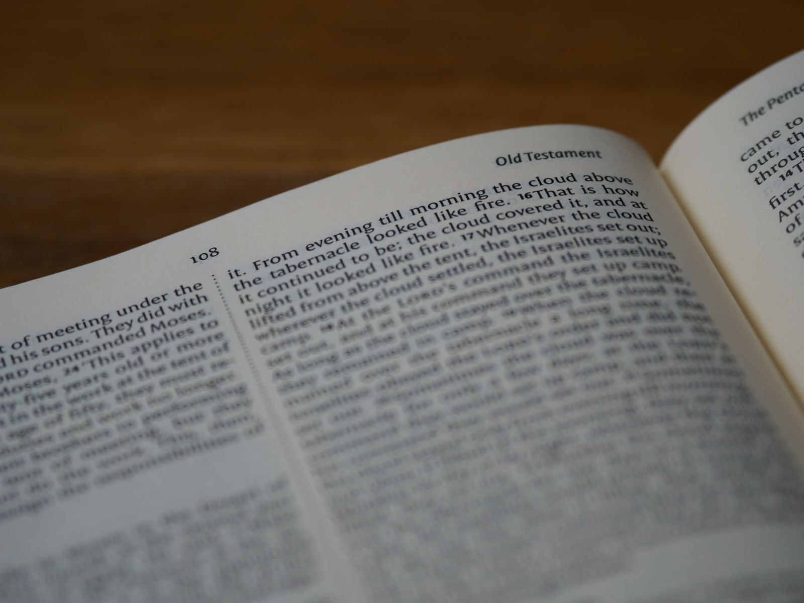

**FELLOWSHIP OF THE HEART**

*Getting Started series — The Four Connects*

Week 8

**Hearing God — PROAPT II**

*The second running — the practice received last week is led this week, by one of the cohort itself*

**COMPANION LESSON PLAN**

Adult edition — the leadership-first year (FotH for a CPR)

*Based on the Intentional Journey of the Heart (IJH), Volumes 1–6*

*John G. Tittle • Curriculum draft v1, July 2026*

# **Quick Reference Card**

*Print this page on cardstock. Two copies in the room. Tonight a rotation leader leads the full walk-through. The adult team's discipline is to be present and not lead.*

## WEEK 8 — HEARING GOD — PROAPT II (90 minutes)

**Aim.** Complete the second running of PROAPT — the full six-step walk-through led by a rotation leader with a fresh passage — and mark the series midpoint with the Mid-Series Pulse.

**Anchor scripture.** Romans 10:17 (faith comes from hearing) and Mark 2:1–12 (the paralytic through the roof) as the worked example.

**Connect focus.** God. Week 7 opened the vertical channel; tonight the cohort works it a second time, and one of their own leads the working.

**Mode.** Member-led end to end, an experienced Companion in the room. Shared walk-through led by the rotation leader; SPLIT for pair practice in cohort circles; MERGE for the Leader Feedback Round, the Mid-Series Pulse, and closing.

**Center.** The rotation leader leads the whole cohort through PROAPT on Mark 2:1–12 — all six steps, timed, from their facilitation card. Then pairs work in cohort circles as in Week 7, with the Tell step shared back into the cohort circle.

**Between-session practice.** Daily PROAPT continues (the journal Week 7–8 pages). Plus: complete the Mid-Series Pulse and bring it back Tuesday.

**IJH source.** Vol 1 Exp 1 (Word→Hearing→Faith); Vol 2 Seventh Exploration (PROAPT and the experiential processes); Handbook Section 11 (the second running).

## WATCH FOR (Week 8 specific risks)

- The rotation leader teaching *about* PROAPT instead of leading people *through* it. The temptation of every first-time leader is to explain. Coach in the dry run: fewer words, more silence, keep the cohort working.
- The cohort deferring to the adult in the room instead of the rotation leader. If eyes keep drifting to the Lead Companion, the block is not member-led. Adults: physically sit back. Chairs against the wall, not in the circle, during the walk-through.
- Daily-practice drop-off at the midpoint. It is normal and the Pulse will show it. Normalize restarting without guilt — the chain picks up where you are, not where you were supposed to be.
- The participant who has done zero daily PROAPT since Week 7 and feels exposed tonight. No shame. Tonight is a fresh start, and the walk-through requires nothing they have not already done once in the room.
- Treating tonight as a repeat. It is not a repeat; it is a completion. Week 7 gave everyone one pass; tonight gives everyone a second pass and gives one member their marquee. Name that at the open.

## CRISIS CONTINGENCIES (Week 8)

Week 8 is the cleanest member-led block in the series by design — scripted practice, low disclosure risk. The standard safeguarding frame applies, and the bright line governs the night: the rotation leader leads the process; the experienced Companions hold anything heavy.

**If a pair's Apply or Tell turns heavy while the rotation leader is leading.** The rotation leader's only job is the handoff — catch the adult's eye, hand it over, keep holding the room. No heroics. Rule two of the three rules that never bend: a rotation leader never takes a disclosure.

**If the Pulse framing stirs something.** Rare, but the halfway question ("how present have I actually been?") can land hard on someone who knows the answer. Watch faces during the close. Follow up offline within 48 hours.

# **Session at a Glance**

## **Why this session, this week**

Last week the cohort received PROAPT — the adult team taught it and everyone worked one passage twice. Tonight the practice comes back around, and the mechanism of the whole leadership pipeline is on display: see one, do one, in the same series, in front of the cohort. A rotation leader who sat as a participant in Week 7 stands tonight and leads the full six-step walk-through with a fresh passage.

Nothing new is taught tonight. That is the point. The second running teaches nothing new; it completes a process the cohort has already begun, and it is the slot a member leads. Because the practice is scripted and the disclosure risk is low, it is the safest possible first full lead — which is exactly why the series puts it here.

Tonight is also the halfway mark: seven weeks behind, seven ahead. The Mid-Series Pulse goes home in every hand at the close and comes back at the Week 9 door. The team will use it.

## **What "the rotation leader leads" means tonight**

The bright line (Handbook 11.2) drawn for tonight specifically:

| **The rotation leader leads** | **The adult team holds** |
| --- | --- |
| The welcome, the blessing, the container restatement. | Nothing visible, if the night goes well. |
| The halfway framing and the daily-practice check-in. | Any disclosure, confession, or crisis that surfaces — instantly, on the handoff. |
| The full six-step walk-through, timed, from the facilitation card. | The Leader Feedback Round (the Lead Companion runs it). |
| The bridge to the split and the closing blessing. | The Mid-Series Pulse distribution and framing. |

The three rules that never bend are in force: the rotation leader never counts as one of the two Companions for a disclosure; the rotation leader never takes a disclosure; the rotation leader leads only what they have first received. All three are satisfied by design tonight — two Companions are in the room, the handoff is rehearsed, and the rotation leader received this exact practice as a participant in Week 7.

## **Dependencies**

## From prior sessions

- Week 7: The cohort has done PROAPT once in the room and (in some measure) daily since. Tonight assumes the six steps are familiar, not mastered.
- Week 4: The cohort has already watched a member lead a second running (Telling Your Story II). Tonight is not the first time one of their own has held the front of the room.
- Weeks 1 and 5: The container holds and its conditions are explicit. The rotation leader will restate them from memory.
- Week 6: The confession channel remains open. If tonight's Apply touches it, the adults hold it.

## **Connect focus**

God. The second of the God-connection sessions. Weeks 9–11 (the Garden twice, then Any Doubts?) go deeper into the same channel tonight keeps open. A cohort that leaves tonight fluent in PROAPT arrives at the Garden used to Spirit-led hearing.

# **Pre-Work for the Companion Team**

## **Personal pre-work**

Every Companion continues daily PROAPT. The midpoint is where the team's own practice quietly thins — and the room will know. Be a current practitioner on Tuesday night, not a supervisor of one.

The Lead Companion PROAPTs Mark 2:1–12 at least twice in the week before the session — not to lead it, but to know its terrain well enough to coach the rotation leader on it.

## **Coaching the rotation leader**

This is the week's real pre-work. Three commitments, non-negotiable:

1. **The rotation leader PROAPTs the chosen passage daily for at least three days before leading it.** They cannot lead the cohort into a passage they have not lived in. Three days minimum; every day is better. The passage will speak differently on the third hearing than the first — and that experience is exactly what they will be inviting the cohort into.
2. **The rotation leader meets the Lead Companion once mid-week for a full dry run.** The whole walk-through, out loud, timed, from the facilitation card (H8.1) — not a conversation about it. The Lead Companion plays the cohort. Coach the two classic first-lead errors: explaining instead of leading, and rushing the silences. Fewer words. Trust the steps.
3. **Rehearse the handoff.** Ask it straight in the dry run: "A pair's Apply turns heavy while you're leading — what do you do?" The answer, every time: catch the adult's eye, hand it over, keep holding the container. No heroics. Drill it until the answer is boring.

**The passage.** Mark 2:1–12 is the default — concrete, narrative, rich in Observe material (four friends, a dug-open roof, forgiveness before healing, the scribes' silent objection). The rotation leader may choose another narrative passage with the Lead Companion's agreement. Note that many participants will have already PROAPTed Mark 2:1–12 in their daily practice (it was Day 6 on the Track One sheet). That is fine, and worth naming from the front: a passage speaks differently on a second hearing. That is half of what tonight demonstrates.

## **Team pre-work**

1. Confirm the passage and the rotation leader who is leading. Confirm which adult holds the handoff (usually the Lead Companion) and make sure the rotation leader knows exactly where that adult will be sitting.
2. Agree the discipline of the night: Companions out of the circle during the walk-through, eyes on the rotation leader, no rescuing. A ten-second stumble the rotation leader recovers from is worth more to their formation than a smooth block a Companion saved.
3. Walk the Leader Feedback Round order (Handbook 11.7): affirmation first, growth second (one thing, not a list), group feedback only by the leader's consent, popcorn-style, "for you" language.
4. Print and count the Mid-Series Pulse (H8.3) — one per participant plus spares. Decide the return point now: the Week 9 door, into the box, folded.

## **Logistics pre-work**

1. Print the rotation leader's facilitation card (H8.1, cardstock, two copies — one for the rotation leader, one spare).
2. Print the Mark 2:1–12 worked-example handout (H8.2, one per participant).
3. Print the Mid-Series Pulse (H8.3, one per participant plus spares).
4. Confirm cohort spaces from prior weeks.

# **Materials and Setup**

### **Materials checklist**

- Chairs in main room as single circle for opening and the walk-through — adult Companions' chairs set slightly outside the circle, deliberately.
- Phone-box at the door.
- Personal Heart Journals (each participant brings).
- Bibles — every participant has access. PROAPT works best with a physical Bible.
- Facilitation card: H8.1 (the rotation leader's copy, plus one spare).
- Mark 2:1–12 handout: H8.2 (one per participant, with the passage printed and space to write).
- Mid-Series Pulse: H8.3 (one per participant, plus spares; pens available).
- A private space per cohort circle.
- Whiteboard or flip chart (the rotation leader may want PROAPT on the board; their call).

### **Pre-session preparation timeline**

| **When** | **Action** | **Who** |
| --- | --- | --- |
| Week before | Confirm passage and leader. The rotation leader begins daily PROAPT on the passage. Print all handouts. | Lead Comp + rotation leader |
| Mid-week | Full dry run, timed, from the card. Rehearse the handoff. | Lead Comp + rotation leader |
| Day before | The rotation leader PROAPTs the passage a final time. Lead Companion walks the room. | Both |
| T-30 min | All Companions and the rotation leader in room. PRAY through the passage as a team. The rotation leader sets the space. | All |
| T-15 min | Door opens. Standard arrival. | Co-Comp |
| T-0 | Doors close. The rotation leader opens. | rotation leader |

# **Detailed 90-Minute Run Sheet**

| **Time** | **Block** | **Mode** | **Lead** | **Notes** |
| --- | --- | --- | --- | --- |
| 6:45–7:00 | Arrival window | Forming | Co-Comp | Standard arrival. |
| 7:00–7:07 | Block 1: Welcome and centering | Shared | rotation leader | Aaronic blessing. Container. The halfway framing. |
| 7:07–7:15 | Block 2: Daily-practice check-in | Shared | rotation leader | How did the daily PROAPT go? Normalize restarting. |
| 7:15–7:20 | Block 3: Why a second running | Shared | rotation leader | Romans 10:17 restated. Frame the fresh passage. |
| 7:20–7:32 | Block 4: PROAPT walked together — Mark 2:1–12 | Shared | rotation leader | The marquee. All six steps, timed, from the card. Adults sit back. |
| 7:32–7:34 | Block 5: Bridge to the split and pair structure | Shared | rotation leader | Pair structure restated. Pray. Split. |
| 7:34–8:02 | Block 6: PROAPT in pairs in cohort circles | Cohort → pairs | Cohort Facs | As Week 7. Switch reader/listener at 13 min. |
| 8:02–8:12 | Block 7: Tell step — sharing in cohort | Cohort | Cohort Facs | Each person tells the cohort circle ONE thing they heard. |
| 8:12–8:18 | Block 8: Merge and Leader Feedback Round | Shared | Lead Comp | Handbook 11.7. Affirmation, growth, consent, popcorn. |
| 8:18–8:24 | Block 9: Mid-Series Pulse and between-session | Shared | Lead Comp | Pulse distributed and framed. Bring it back Tuesday. |
| 8:24–8:30 | Block 10: Closing container | Shared | rotation leader | Container reaffirmed. Aaronic blessing. |

# **Block-by-Block: Scripts and Notes**

*Blocks 1–5 and 10 are the rotation leader's blocks. The italicized scripts in those blocks are theirs — written here as a model for the dry run, not a cage. The rotation leader should say it in their own words; what is fixed is the shape, the timings, and the handoff rule.*

## **Block 1 — Welcome and Centering (7:00–7:07, 7 min)**
## rotation leader's script

*"Welcome back. Phones in the box. Let me speak the blessing first. The Lord bless you and keep you; the Lord make His face shine on you and be gracious to you; the Lord turn His face toward you and give you peace."*

*"Container reminder: Safe, Present, Clear, Intentional. Same four conditions, same room, same us."*

*"Tonight is Week 8, and that means something: we are at the halfway mark of the fifteen weeks — seven behind, seven ahead. Seven weeks ago most of us walked in not knowing what this was. Tonight one of us is leading it. That's not an accident; that's the design."*

*"Last week the team taught us PROAPT and we all worked one passage. Tonight we run it again — a fresh passage, same six steps, and this time I'm leading the walk-through. The team is here. But the practice is ours now."*

### **Note for the adult team**

From the moment the rotation leader starts speaking, sit back — outside the circle, eyes on the rotation leader, faces warm and unhelpful. If the cohort looks to you, look at the rotation leader. The room learns who is leading from where the Companions look.

## **Block 2 — Daily-Practice Check-in (7:07–7:15, 8 min)**
## rotation leader's script

*"Quick check-in on the daily PROAPT. One sentence each, whoever wants: how did the week of daily practice actually go? Honest answers. 'I did two days and stopped' is an honest answer."*

*(Take 3–4 contributions. Receive them all the same way.)*

*"If your week was thin or empty — no guilt. The halfway point is where daily practice thins out for almost everyone; that's normal, not failure. The practice picks up where you are, not where you were supposed to be. Tonight is a fresh start, and everything we do tonight works whether you did seven days or zero."*

*“And before we move on: one true sentence. One true thing about your own week with God, however small. ‘Nothing came’ is a true sentence. We receive; we do not fix.”*

*(The leader goes first, with something real — the engine of every telling practice this year. Then around the circle, brief, pass anytime. This beat runs every week of the year — the smallest rung of costly telling, its occasion scheduled so the muscle always has one.)*

## **Block 3 — Why a Second Running (7:15–7:20, 5 min)**
## rotation leader's script

*"The verse under all of this is still Romans 10:17: 'So faith comes from hearing, and hearing through the word of Christ.' Word, hearing, faith. The chain only works if we hear — and hearing is a skill, and skills take reps. Last week was rep one. Tonight is rep two."*

*"Tonight's passage is Mark 2:1–12 — the paralytic whose friends dig through a roof to get him to Jesus. Some of you have already PROAPTed this one in your daily practice this week. Good. Don't skip it because you've been here — a passage speaks differently on a second hearing. That's not a theory; you're about to test it."*

*"Same six steps as last week. I'll keep us on time. Handouts are coming around — Bibles open to Mark 2."*

## **Block 4 — PROAPT Walked Together: Mark 2:1–12 (7:20–7:32, 12 min)**
This is the marquee block of the night. The rotation leader leads all six steps, timed, from their facilitation card (H8.1). The cohort works their handout (H8.2). The adult team does not speak unless the handoff comes.

## How the rotation leader walks it (from the card)

**PRAY (90 sec). "Thirty seconds, eyes closed. Tell the Holy Spirit you want to hear what He has for you tonight — not what you already know about this passage. Especially if you've read it this week." Silence. Then: "Holy Spirit, You are welcome here. Speak. We are listening."**

**READ (2 min). "Read it slowly, on your own, just to receive it. Don't analyze yet." The rotation leader reads it once aloud, unhurried, then silence while the cohort reads.**

**OBSERVE (3.5 min). "What do you notice? Write three things. What stands out? What's strange? Four men carry one man — what does that take? They wreck a roof — whose roof? Jesus sees their faith — whose faith? He forgives before He heals — why that order?" Take 60 seconds writing, then ask 3–4 people to share one observation each. Receive; don't evaluate.**

**APPLY (3.5 min). "What is this saying to YOU, today, specifically? Where in your life are you the one on the mat — stuck, carried, waiting? Or are you one of the four — and who are you carrying, or who should you be? Is there a roof you need to dig through to get someone to Jesus? Be specific." 90 seconds writing. Then 2–3 people share their Apply.**

**PRAY AGAIN (90 sec). "Eyes closed. Tell God what you heard. Tell Him what you're willing to do — or what you're struggling to be willing to do." Silence.**

**TELL (60 sec). "The Tell step happens in your cohort circle tonight, like last week. Don't skip it in your daily practice either — it's the step that makes the hearing stick."**

### **Notes for the adult team during Block 4**

- Do not rescue a silence. The rotation leader was coached to hold them; let them.
- If the rotation leader stumbles on a timing, let the stumble happen and let them recover. That recovery is the formation.
- The handoff: if any sharing turns heavy, the rotation leader catches the designated adult's eye and hands it over — and the adult takes it fully, immediately, without making the handoff feel like an alarm. The rotation leader keeps holding the room.

## **Block 5 — Bridge to the Split and Pair Structure (7:32–7:34, 2 min)**
## rotation leader's script

*"Same pair structure as last week. In your cohort circle you'll pair up — one Reader, one Listener. Reader leads the six steps; Listener works alongside without interrupting. After thirteen minutes, switch. Stay with Mark 2 or take a fresh passage — Reader's choice."*

*"Your Cohort Companion assigns the pairs. Mix it up."*

*"Pray with me. Father, You've already spoken tonight. Speak again in the pairs — something specific, something each of us can hear. Amen. Go."*

## **Block 6 — PROAPT in Pairs (7:34–8:02, 28 min)**
Each cohort circle splits into pairs, as Week 7. The Cohort Companion pairs people deliberately — different pairings than last week if possible.

## Inside the cohort circle

**Pairing (1 min). Cohort Companion assigns pairs. Pairs find a quiet spot in or near the cohort space.**

**First pass (13 min). Reader leads through PROAPT on the chosen passage. Listener works alongside but does not interrupt. Reader's Tell at the end goes to the Listener (1 sentence).**

**Switch (1 min). Roles reverse. Same passage or new.**

**Second pass (13 min). Same structure with roles reversed.**

## Cohort Companion: when to intervene

Same interventions as Week 7 — the unstick prompts for Observe ("one specific word or phrase that caught you") and Apply ("one situation in your life right now — be specific"), the slow-down for rushers, the second-passage assignment for early finishers. One Week 8 addition:

- If a pair treats the pass as a rerun ("we did this passage Thursday") — "Then you know what it said Thursday. What is it saying tonight? Second hearings are where the specific word comes."

## **Block 7 — Tell Step in Cohort (8:02–8:12, 10 min)**
Re-form into cohort circle (out of pairs). Each participant tells the cohort circle ONE thing they heard tonight. By now the room expects this step; let the expectation work.

## Inside the cohort circle

**Cohort Companion opens (30 sec). "The Tell step — second time as a cohort, so you know the shape. One specific thing you heard tonight. One sentence. We listen to receive."**

**Around the circle (~60 sec per person). Each person tells one thing.**

**Receiving (after each). "We hear that" or "Thank you for naming that." Brief. Receive without preaching.**

**Closing of cohort (1 min). Cohort Companion: "Take what you heard with you. It was given to be walked out."**

## **Block 8 — Merge and Leader Feedback Round (8:12–8:18, 6 min)**
Everyone back in the single circle. The Lead Companion runs the Leader Feedback Round (Handbook 11.7) for the rotation leader, while the cohort is still present. The order is fixed.

## Script (Lead Companion)

*"Before anything else — [name] led the whole walk-through tonight. We do the feedback round now, same as after Week 4."*

*"First, from the team: what [name] did well and what we'd want to see again."* (Two or three specific affirmations from the adult team. Specific — "you held the silence after Apply and didn't fill it" — not general.)

*"One thing to try differently next time."* (One thing. Two at most. Not a list.)

*"[Name] — would you like feedback from the group too?"* (The rotation leader decides. If no, the round ends here — no pressure, no exposure.)

*(If yes, popcorn-style:)* *"For anyone who has something — what worked well for you? One suggestion for [name] to consider next time?"*

The "for you" language matters: the group reflects on their own experience, not grading a friend. Keep it moving; the round is six minutes, not a review board.

*(Then the teach-back, leader only: “If I were to teach tonight’s process to someone, here is what I would tell them.” One or two sentences, and done.)*

## **Block 9 — Mid-Series Pulse and Between-Session (8:18–8:24, 6 min)**
## Script (Lead Companion)

*"Two things going home with you tonight. First, the daily PROAPT continues — one passage, five to fifteen minutes, every day, journal Week 7–8 pages. If last week thinned out, restart tomorrow. No guilt, no doubling up."*

*"Second — this."* (Hold up H8.3; hand the stack around.) *"We are halfway through the Getting Started series. We want to know what is working and what is not so we can use the second half well. This is the Mid-Series Pulse: one page, three questions, five minutes of your time at home. Be honest. The team uses these to adjust pacing, depth, and emphasis for Weeks 9 through 15."*

*"You can sign it or leave it anonymous — your choice; there's a line at the bottom you can skip. Fold it, bring it back Tuesday, drop it in the box at the door. Every one of these gets read."*

*“Each of you fills out your own. Don’t compare answers unless you want to — although honestly, comparing them over coffee this week might be the best conversation you have.”*

## **Block 10 — Closing Container (8:24–8:30, 6 min)**
## rotation leader's script

*"One thing before we close. Seven weeks ago none of us had done this. Tonight we ran the whole practice ourselves — and next Tuesday we go deeper, into the Garden. What we practiced tonight is the skill the Garden depends on: hearing Him. Keep the daily practice alive this week. It's the hinge."*

*"Final blessing. Hands up."*

*"The Lord bless you and keep you; the Lord make His face shine on you and be gracious to you; the Lord turn His face toward you and give you peace."*

*"PROAPT one passage tomorrow. Pulse in the box Tuesday. See you then."*

# **Differentiation by Cohort**

## Those doing this work for the first time

The second running lands well with first-timers — the structure is now familiar, and familiarity frees attention for the hearing itself.

- Mark 2:1–12 was Day 6 on the Track One sheet, so many will have seen it. Lean into the second-hearing frame rather than apologizing for it.
- The Apply prompts on the card (on the mat / one of the four / the roof) are concrete. Use them verbatim.
- Pulse: assure the room the 1–10 question is not a grade and nobody is in trouble for a low number. “4 — I keep thinking about the budget meeting” is gold for the team.

## The veterans

Tonight one of their own is at the front. That changes the room for every member in it, whether they are leading or watching.

- The members not leading tonight are watching their own future — several of them will take a later slot. Name it privately: “Watch how this goes. Your slot is coming.”
- Watch for the member who competes with the leader — the too-sharp Observe, the show-off Apply. Redirect to specificity, which is humbling in the right way.
- Tell step: veterans still hesitate to claim God said something specific. Same gentle affirmation as Week 7 — “what you heard counts even if you’re not 100% sure it was Him.”
- Pulse: the most useful Q3 answers come when pushed past “participate more.” Ask for behavior: what, when, how often.

## The ordained and the staff

One of the cohort leading the room is, for some of the ordained, the most persuasive thing this series will ever show them about what the year is building.

- The hardest differentiation of the night: the rotation leader’s spouse or closest colleague is in the room. Brief them beforehand — no coaching from the circle, no beaming commentary, no rescue. Receive the leadership like everyone else’s.
- Watch for members who direct answers to the Companions during the walk-through. The Companions redirect with their eyes: look at the rotation leader.
- Pulse: honest Q1 answers (“body in the room, mind on the mortgage”) are exactly what the instrument is for. Say so.
- The ride-home conversation after tonight — a member telling their spouse what they saw in the one who led — is between-session gold. Suggest it.

# **Closing Practice in Detail**

### **Layer 1 — The feedback round as formation**

The Leader Feedback Round is the closing practice tonight in all but name — the cohort watches leadership being formed in public, safely. Strengths before growth, one growth item, consent before group input. The cohort learns how this community treats its leaders by watching six minutes of it.

### **Layer 2 — The Pulse as an act of presence**

Frame the Pulse not as a survey but as a small act of the same honesty the series has been practicing. Question 1 is an Examen in miniature. A cohort that answers it truthfully has already engaged differently.

### **Layer 3 — The Aaronic blessing**

Same as prior weeks — spoken tonight by the rotation leader, which is its own quiet milestone.

# **Between-Session Practice**

## This week's practice

- DAILY PROAPT continues (the journal Week 7–8 pages). One short passage. Five to fifteen minutes. Every day. If last week thinned, restart without guilt — no doubling up, pick up where you are.
- Complete the Mid-Series Pulse (H8.3) and bring it back to the Week 9 door. Fold it; drop it in the box.
- The morning question, evening journal note, and Five-Minute Examen continue.

# **Companion Debrief Prompts**

### **Signs the session worked**

- The rotation leader led all six steps within a few minutes of the card's timings, and led people *through* the practice rather than talking *about* it — specifically, the Apply coaching pushed for specifics.
- The cohort answered to the rotation leader, not to the adults. Eyes stayed forward.
- Tell-step contributions were specific and varied — and at least one was costly. Note who.
- The Pulse went out cleanly: every hand, framed without apology, return point clear.
- The Leader Feedback Round ran in order and the rotation leader received both halves without inflating or collapsing.

### **Signs the session did not work**

- The rotation leader lectured — long explanations, short silences, cohort watching instead of working.
- The room deferred to the Companions; the walk-through was member-fronted but Companion-led.
- The daily-practice check-in surfaced near-total drop-off and it was met with guilt rather than a fresh start.
- The Pulse was rushed or apologized for ("if you have time..."). It is not optional homework; it steers seven weeks.

### **The rotation leader's debrief (separate, within 48 hours)**

- How did the full lead go from the inside — specifically the Apply coaching? Could they push for specificity without prying?
- What did the room do in the first ten seconds when something went sideways — and what did the rotation leader do? (There is always a sideways moment. Find it and mine it.)
- Did the handoff rehearsal hold, or was it never tested? If never tested, re-drill it anyway before Week 10.
- What to coach before their next lead: Week 10 is Garden of Your Heart II — a guided interior exercise, a much bigger lift than a scripted practice. Name one growth edge from tonight and build the Week 10 coaching around it.

### **People to follow up with**

- Anyone the halfway framing or the Pulse visibly landed on. Offline within 48 hours.
- Anyone whose daily practice is at zero and who seemed exposed by the check-in. Fresh-start conversation, no shame.
- The rotation leader's spouse, if they are in the cohort — a two-minute word about what the team saw in the one who led.

# **Handouts**

Three handouts for Week 8. The facilitation card is for the rotation leader; the worked example and the Pulse are for every participant.

- H8.1 — rotation leader's PROAPT Facilitation Card (cardstock, the rotation leader's copy plus a spare)
- H8.2 — Mark 2:1–12 Worked Example (with space to write each step)
- H8.3 — The Mid-Series Pulse (one page, every participant, returns at the Week 9 door)

**Handout H8.1 — The rotation leader's PROAPT Facilitation Card**

*Print on cardstock. This is your card for the walk-through. The timings keep you honest; the one-liners keep you moving. Fewer words, more silence. You are leading people through the practice, not teaching about it.*

## The walk-through — 14 minutes, six steps

**P — PRAY (90 sec).** *"Thirty seconds, eyes closed. Tell the Holy Spirit you want to hear what He has for you tonight."* Hold the silence. Then pray one sentence aloud and move.

**R — READ (2 min).** Read the passage aloud once, slowly. Then: *"Read it again on your own, just to receive it. Don't analyze yet."* Silence while they read.

**O — OBSERVE (3.5 min).** *"Write three things you notice. What stands out? What's strange? What did you not see before?"* 60 seconds writing, then take 3–4 shares. Receive each one; evaluate none.

**A — APPLY (3.5 min).** *"What is this saying to YOU, today, specifically? Not in general — in your actual life, this week."* 90 seconds writing, then 2–3 shares. If an Apply is vague, ask once: *"Can you make that more specific?"*

**P — PRAY AGAIN (90 sec).** *"Eyes closed. Tell God what you heard, and what you're willing to do — or struggling to be willing to do."* Hold the silence. Do not fill it.

**T — TELL (60 sec).** *"The Tell happens in your cohort circle tonight. Don't skip it in your daily practice either — it's the step that makes the hearing stick."*

## The handoff rule (never bends)

**If anything heavy surfaces while you are leading — catch the adult's eye, hand it over, keep holding the room. That is your whole job in that moment. You never take a disclosure. No heroics.**

## If you get lost

Look at the card. Say the next one-liner. The steps carry you — that is what they are for.

**Handout H8.2 — Mark 2:1–12, PROAPT Walk-Through**

## Mark 2:1–12 (ESV)

*"And when he returned to Capernaum after some days, it was reported that he was at home. And many were gathered together, so that there was no more room, not even at the door. And he was preaching the word to them. And they came, bringing to him a paralytic carried by four men. And when they could not get near him because of the crowd, they removed the roof above him, and when they had made an opening, they let down the bed on which the paralytic lay. And when Jesus saw their faith, he said to the paralytic, 'Son, your sins are forgiven.'"*

*"Now some of the scribes were sitting there, questioning in their hearts, 'Why does this man speak like that? He is blaspheming! Who can forgive sins but God alone?' And immediately Jesus, perceiving in his spirit that they thus questioned within themselves, said to them, 'Why do you question these things in your hearts? Which is easier, to say to the paralytic, "Your sins are forgiven," or to say, "Rise, take up your bed and walk"? But that you may know that the Son of Man has authority on earth to forgive sins' — he said to the paralytic — 'I say to you, rise, pick up your bed, and go home.'"*

*"And he rose and immediately picked up his bed and went out before them all, so that they were all amazed and glorified God, saying, 'We never saw anything like this!'"*

### **PRAY (write a one-sentence prayer)**

\_\_\_\_\_\_\_\_\_\_\_\_\_\_\_\_\_\_\_\_\_\_\_\_\_\_\_\_\_\_\_\_\_\_\_\_\_\_\_\_\_\_\_\_\_\_\_\_\_\_\_\_\_\_\_\_\_\_\_\_\_\_\_\_\_\_\_\_\_\_\_\_\_\_\_\_\_\_\_\_

\_\_\_\_\_\_\_\_\_\_\_\_\_\_\_\_\_\_\_\_\_\_\_\_\_\_\_\_\_\_\_\_\_\_\_\_\_\_\_\_\_\_\_\_\_\_\_\_\_\_\_\_\_\_\_\_\_\_\_\_\_\_\_\_\_\_\_\_\_\_\_\_\_\_\_\_\_\_\_\_

### **READ (just read it; nothing to write yet)**

*If you PROAPTed this passage in your daily practice this week, read it as if for the first time anyway. A passage speaks differently on a second hearing.*

### **OBSERVE (write 3 observations)**

1. \_\_\_\_\_\_\_\_\_\_\_\_\_\_\_\_\_\_\_\_\_\_\_\_\_\_\_\_\_\_\_\_\_\_\_\_\_\_\_\_\_\_\_\_\_\_\_\_\_\_\_\_\_\_\_\_\_\_\_\_\_\_\_\_\_\_\_\_\_\_\_\_\_\_\_\_

2. \_\_\_\_\_\_\_\_\_\_\_\_\_\_\_\_\_\_\_\_\_\_\_\_\_\_\_\_\_\_\_\_\_\_\_\_\_\_\_\_\_\_\_\_\_\_\_\_\_\_\_\_\_\_\_\_\_\_\_\_\_\_\_\_\_\_\_\_\_\_\_\_\_\_\_\_

3. \_\_\_\_\_\_\_\_\_\_\_\_\_\_\_\_\_\_\_\_\_\_\_\_\_\_\_\_\_\_\_\_\_\_\_\_\_\_\_\_\_\_\_\_\_\_\_\_\_\_\_\_\_\_\_\_\_\_\_\_\_\_\_\_\_\_\_\_\_\_\_\_\_\_\_\_

### **APPLY (write what the Spirit is saying to YOU, today)**

*Where in your life are you the one on the mat — stuck, carried, waiting? Or are you one of the four — and who are you carrying? Is there a roof you need to dig through to get someone to Jesus?*

\_\_\_\_\_\_\_\_\_\_\_\_\_\_\_\_\_\_\_\_\_\_\_\_\_\_\_\_\_\_\_\_\_\_\_\_\_\_\_\_\_\_\_\_\_\_\_\_\_\_\_\_\_\_\_\_\_\_\_\_\_\_\_\_\_\_\_\_\_\_\_\_\_\_\_\_\_\_\_\_

\_\_\_\_\_\_\_\_\_\_\_\_\_\_\_\_\_\_\_\_\_\_\_\_\_\_\_\_\_\_\_\_\_\_\_\_\_\_\_\_\_\_\_\_\_\_\_\_\_\_\_\_\_\_\_\_\_\_\_\_\_\_\_\_\_\_\_\_\_\_\_\_\_\_\_\_\_\_\_\_

\_\_\_\_\_\_\_\_\_\_\_\_\_\_\_\_\_\_\_\_\_\_\_\_\_\_\_\_\_\_\_\_\_\_\_\_\_\_\_\_\_\_\_\_\_\_\_\_\_\_\_\_\_\_\_\_\_\_\_\_\_\_\_\_\_\_\_\_\_\_\_\_\_\_\_\_\_\_\_\_

### **PRAY AGAIN (one-sentence response to God)**

\_\_\_\_\_\_\_\_\_\_\_\_\_\_\_\_\_\_\_\_\_\_\_\_\_\_\_\_\_\_\_\_\_\_\_\_\_\_\_\_\_\_\_\_\_\_\_\_\_\_\_\_\_\_\_\_\_\_\_\_\_\_\_\_\_\_\_\_\_\_\_\_\_\_\_\_\_\_\_\_

\_\_\_\_\_\_\_\_\_\_\_\_\_\_\_\_\_\_\_\_\_\_\_\_\_\_\_\_\_\_\_\_\_\_\_\_\_\_\_\_\_\_\_\_\_\_\_\_\_\_\_\_\_\_\_\_\_\_\_\_\_\_\_\_\_\_\_\_\_\_\_\_\_\_\_\_\_\_\_\_

### **TELL (one sentence to share with your cohort circle)**

\_\_\_\_\_\_\_\_\_\_\_\_\_\_\_\_\_\_\_\_\_\_\_\_\_\_\_\_\_\_\_\_\_\_\_\_\_\_\_\_\_\_\_\_\_\_\_\_\_\_\_\_\_\_\_\_\_\_\_\_\_\_\_\_\_\_\_\_\_\_\_\_\_\_\_\_\_\_\_\_

\_\_\_\_\_\_\_\_\_\_\_\_\_\_\_\_\_\_\_\_\_\_\_\_\_\_\_\_\_\_\_\_\_\_\_\_\_\_\_\_\_\_\_\_\_\_\_\_\_\_\_\_\_\_\_\_\_\_\_\_\_\_\_\_\_\_\_\_\_\_\_\_\_\_\_\_\_\_\_\_

**Handout H8.3 — The Mid-Series Pulse**

*One page. Three questions. Fold it and drop it in the box at the door next Tuesday.*

**We are halfway through the Getting Started series. We want to know what is working and what is not so we can use the second half well. Be honest. The team uses these to adjust pacing, depth, and emphasis.**

### **1. On a scale of 1–10, how present have I actually been in these sessions so far?**

*(1 = barely showing up; 5 = body in the room, mind elsewhere; 10 = fully engaged, doing the work)*

My number: \_\_\_\_\_\_\_\_

One sentence about why:

\_\_\_\_\_\_\_\_\_\_\_\_\_\_\_\_\_\_\_\_\_\_\_\_\_\_\_\_\_\_\_\_\_\_\_\_\_\_\_\_\_\_\_\_\_\_\_\_\_\_\_\_\_\_\_\_\_\_\_\_\_\_\_\_\_\_\_\_\_\_\_\_\_\_\_\_\_\_\_\_

\_\_\_\_\_\_\_\_\_\_\_\_\_\_\_\_\_\_\_\_\_\_\_\_\_\_\_\_\_\_\_\_\_\_\_\_\_\_\_\_\_\_\_\_\_\_\_\_\_\_\_\_\_\_\_\_\_\_\_\_\_\_\_\_\_\_\_\_\_\_\_\_\_\_\_\_\_\_\_\_

### **2. What is one thing that has surprised me — about myself, about God, or about someone in this room?**

\_\_\_\_\_\_\_\_\_\_\_\_\_\_\_\_\_\_\_\_\_\_\_\_\_\_\_\_\_\_\_\_\_\_\_\_\_\_\_\_\_\_\_\_\_\_\_\_\_\_\_\_\_\_\_\_\_\_\_\_\_\_\_\_\_\_\_\_\_\_\_\_\_\_\_\_\_\_\_\_

\_\_\_\_\_\_\_\_\_\_\_\_\_\_\_\_\_\_\_\_\_\_\_\_\_\_\_\_\_\_\_\_\_\_\_\_\_\_\_\_\_\_\_\_\_\_\_\_\_\_\_\_\_\_\_\_\_\_\_\_\_\_\_\_\_\_\_\_\_\_\_\_\_\_\_\_\_\_\_\_

\_\_\_\_\_\_\_\_\_\_\_\_\_\_\_\_\_\_\_\_\_\_\_\_\_\_\_\_\_\_\_\_\_\_\_\_\_\_\_\_\_\_\_\_\_\_\_\_\_\_\_\_\_\_\_\_\_\_\_\_\_\_\_\_\_\_\_\_\_\_\_\_\_\_\_\_\_\_\_\_

### **3. What is one specific way I want to engage differently for the second half (Weeks 9–15)?**

\_\_\_\_\_\_\_\_\_\_\_\_\_\_\_\_\_\_\_\_\_\_\_\_\_\_\_\_\_\_\_\_\_\_\_\_\_\_\_\_\_\_\_\_\_\_\_\_\_\_\_\_\_\_\_\_\_\_\_\_\_\_\_\_\_\_\_\_\_\_\_\_\_\_\_\_\_\_\_\_

\_\_\_\_\_\_\_\_\_\_\_\_\_\_\_\_\_\_\_\_\_\_\_\_\_\_\_\_\_\_\_\_\_\_\_\_\_\_\_\_\_\_\_\_\_\_\_\_\_\_\_\_\_\_\_\_\_\_\_\_\_\_\_\_\_\_\_\_\_\_\_\_\_\_\_\_\_\_\_\_

\_\_\_\_\_\_\_\_\_\_\_\_\_\_\_\_\_\_\_\_\_\_\_\_\_\_\_\_\_\_\_\_\_\_\_\_\_\_\_\_\_\_\_\_\_\_\_\_\_\_\_\_\_\_\_\_\_\_\_\_\_\_\_\_\_\_\_\_\_\_\_\_\_\_\_\_\_\_\_\_

*Optional: my name (skip if you prefer anonymous)* \_\_\_\_\_\_\_\_\_\_\_\_\_\_\_\_\_\_\_\_\_\_\_\_\_\_\_\_\_\_\_\_\_\_\_\_\_\_
